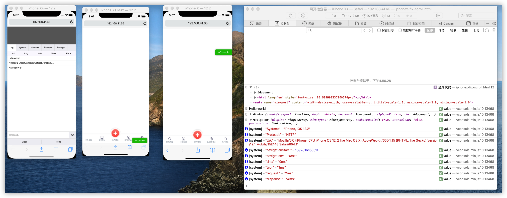
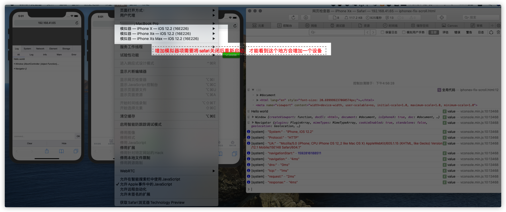

# 18.1 h5模拟器-safari


```
$ open /Applications/Xcode.app/Contents/Developer/Applications/Simulator.app
```






alias  proxy export all_proxy=socks5://127.0.0.1:1080

alias unproxy = 'unset all_proxy'

