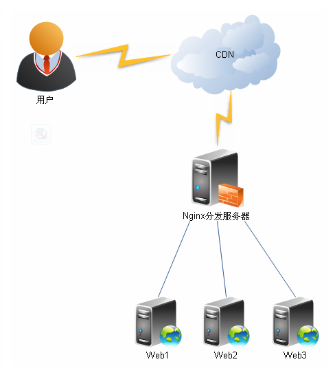

<!--
 * @version: v0.0.1
 * @Author: hailong.chen
 * @Date: 2020-01-04 00:11:49
 * @LastEditors  : hailong.chen
 * @LastEditTime : 2020-01-04 10:56:15
 * @Descripttion: 
 -->
# 8.nginx
实现前后端分离，可以让前后端独立开发、独立部署、独立单测，双方通过JSON进行数据交互。

　　对于前端开发人员来说，不用每次调试都需要启动或配置Java/Tomcat运行环境；对于后端开发人员来说 ，也不用在需要往JSP页面注入数据。

　　通过nginx来部署前端代码，可以帮助前端实现以下基本需求：

1、请求转发，解决请求跨域的问题

```
server {
        listen      7777;
        location /{
            root  /Users/xiaoyun/git/someproject/dist;
        }

        location /api/v1{
              proxy_set_header Host api.yourhost.com;
              proxy_pass http://api.yourhost.com/api/v1/;
        }

        location /api/v2{
                proxy_pass  http://api.yourhost.com/new;
        }
    }
```
　　以上是一段nginx配置参考：

　　listen    nginx服务端口号

　　location  /    设置默认根目录所访问的本地代码路径，这里还可以设置默认主页index

　　proxy_pass  请求转发，可以配置多个，从上至下进行匹配

　　以第一个配置为例，即所有本地以/api/v1开头的请求都会转发至对应线上服务器，例如： http://localhost:7777/api/v1/getConfig 则会自动转发到：http://api.yourhost.com/api/v1/getConfig

　　另外，还需要注意的是，proxy_pass配置的路径如果是以/结尾，如上面的配置v1，那么此时路径为相对路径，否则为绝对路径

　　例如 v2的转发配置：如果请求 http://localhost:7777/api/v2/user/list  则会转发自 http://api.yourhost.com/new/user/list ，不会带有原路径的 /api/v2

2、gzip请求压缩

　　网站开启gzip压缩，不仅能够节省带宽，也能够快速响应用户的访问

```
http{
    gzip  on;
    gzip_proxied any;
    gzip_min_length  1024;
    gzip_buffers    4 8k;
    gzip_comp_level 3;
    gzip_types      text/plain text/css application/x-javascript application/javascript application/xml application/json;
}
```
　　以下为各项配置作用：

　　gzip on;      （启用 gzip 压缩功能）

　　gzip_proxied any;  （nginx 做前端代理时启用该选项，表示无论后端服务器的headers头返回什么信息，都无条件启用压缩）

　　gzip_min_length  1024; （最小压缩的页面，如果页面过于小，可能会越压越大，这里规定大于1K的页面才启用压缩）

　　gzip_buffers    4 8k; （设置系统获取几个单位的缓存用于存储gzip的压缩结果数据流）

　　gzip_comp_level 3; （压缩级别，1压缩比最小处理速度最快，9压缩比最大但处理最慢，同时也最消耗CPU,一般设置为3就可以了）

　　gzip_types      text/plain text/css application/x-javascript application/javascript application/xml application/json; （什么类型的页面或文档启用压缩）


nginx部署前后端分离项目


#user  nobody;
worker_processes  1; 

#error_log  logs/error.log;
#error_log  logs/error.log  notice;
#error_log  logs/error.log  info;

#pid        logs/nginx.pid;


events {
    worker_connections  1024;  
}


http {
    include       mime.types;
    default_type  application/octet-stream;

    #log_format  main  '$remote_addr - $remote_user [$time_local] "$request" '
    #                  '$status $body_bytes_sent "$http_referer" '
    #                  '"$http_user_agent" "$http_x_forwarded_for"';

    #access_log  logs/access.log  main;

    sendfile        on;
    #tcp_nopush     on;

    #keepalive_timeout  0;
    keepalive_timeout  65;

    #gzip  on;
    
    upstream wallet {     #配置反向代理服务地址
       server 127.0.0.1:9200;
    }
    
    server {
        listen       9999; 
        server_name  localhost;

        #charset koi8-r;

        #access_log  logs/host.access.log  main;
        
        location / {  # 配置 拦截路径
            root   html;
            index  index.html index.htm;
        }
        
        location /api/ {   # /*/ 两个斜杠才可以拦截住
            proxy_redirect   off; 
            proxy_set_header Host $host;
            proxy_set_header X-Real-IP $remote_addr;
            proxy_set_header X-Forwarded-For $proxy_add_x_forwarded_for;
            proxy_pass http://wallet/;    # 定向到da
        }
        
        
        error_page  404              /index.html;

        # redirect server error pages to the static page /50x.html
        #
        error_page   500 502 503 504  /50x.html;
        location = /50x.html {
            root   html;
        }

        # proxy the PHP scripts to Apache listening on 127.0.0.1:80
        #
        #location ~ \.php$ {
        #    proxy_pass   http://127.0.0.1;
        #}

        # pass the PHP scripts to FastCGI server listening on 127.0.0.1:9000
        #
        #location ~ \.php$ {
        #    root           html;
        #    fastcgi_pass   127.0.0.1:9000;
        #    fastcgi_index  index.php;
        #    fastcgi_param  SCRIPT_FILENAME  /scripts$fastcgi_script_name;
        #    include        fastcgi_params;
        #}

        # deny access to .htaccess files, if Apache's document root
        # concurs with nginx's one
        #
        #location ~ /\.ht {
        #    deny  all;
        #}
    }
}


部署前后端分离式nginx配置的完整步骤

这篇文章主要给大家介绍了关于如何部署前后端分离式nginx配置的完整步骤，文中通过示例代码介绍的非常详细，对大家学习或者使用nginx具有一定的参考学习价值，需要的朋友们下面来一起学习学习吧
前言

老生常谈了，这里谈谈我的理解的前后端分离，简单的分离无非是将原来mvc的view层剥离出来，独立一个成为Servlet服务，Servlet之间依靠http连通。这里的view Servlet容器可以是任意一种服务端服务，Tomcat、Apache、Nginx、IIS，都可以。这里以常用的Nginx为例子做简单的介绍。
需求分析
先来一波需求分析。

单项目
单项目指的是一台服务器部署一个前端服务，使www.xxx.com => index.html的单一指向。
多项目
多项目指的是一台服务器部署多个前端服务，使www.xxx.com/a => a.html,www.xxx.com/b => b.html等多指向。
请求代理。
cookie domain重写。
cookie path 重写。
提示：这里做好写conf.d/*.conf，这样配置可以分离处理。
公共配置
?
1
2
3
4
5
6
7
8
9
10
11
server{
 listen 80; # 配置端口
 server_name _; # 配置域名
 charset utf-8; # 编码
 access_log /xxx/log/nginx_access.log main; # 成功日志
 error_log /xxx/log/nginx_error.log error; # 错误日志
 index index.html; # 查找文件顺序
 set $root /xxx/nginx/; # 变量设置，设置公共路径
  
 # 其余location
}
请手动去/xxx/log/nginx_access.log和/xxx/log/nginx_error.log下新建对应文件。可能会执行nginx reload第一次执行时会报错。
set的$root路径为绝对路径，access_log和error_log同样都是绝对路径。

单项目配置
目录结构
?
1
2
3
nginx
|----- index.html
|----- user.html
location配置
?
1
2
3
location / {
    root $root;
}
好了最简单的基于根路径配置就这样好了，这里无非是通过location配置一条路径，然后指向到$root文件夹下的index.html这个文件下。
多项目配置
目录结构
?
1
2
3
4
5
nginx
|----- a
    |----- index.html
|----- b
    |----- index.html
多条location配置
?
1
2
3
4
5
6
7
8
9
10
11
location ^~ /a {
  alias $root/a;
}
 
location ^~ /b {
  alias $root/b;
}
 
location / {
  root $root;
}
跟单项目唯一的不同点在于，root和alias的区别，root指的是文件的绝对匹配路径，而alias则是相对匹配。root可以再http、server、location中配置，而alias只能在location中配置。这我还加入的正则^~，当匹配/a或者/b时，不管location的路径是什么，资源的真实路径一定是都是 alias 指定的路径。这样的我就能让/a、/b拥有匹配的到路径之后，拥有跳转固定路径，这在spa式的前端项目非常有用的，因为其实核心文件只有一个index.html文件（资源文件另说）。这样我永远跳转index.html就能保证浏览器手动刷新的时候，不会根据root路径去查找服务器其他路径的资源。然后设置spa的根路径和 /b必须是匹配的。
为什么会有这种需求？前端是轻便的，我们为了达到节约服务器与聚合同类型业务的时候，就会使用到这种机制。就像希望admin.xxxx.com/a => 运营管理台、admin.xxxx.com/b => erp管理台一样。所有admin这个域名下我们只要切出子路径即可。简单轻便。
请求转发
?
1
2
3
location ^~ /api {
  proxy_pass http://api.xxx.com/;
}
这里就特别简单了，我通过正则匹配/api这个请求，通过proxy_pass属性，将请求定向到http://api.xxx.com。即可
修改cookie domain
有时候处于安全考虑，我们会设置一定的cookie的domain属性这是对于nginx转发来说就很不友好了。当然也是有解决手段的，也很简单。
?
1
2
3
location {
  proxy_cookie_domain <本域的domain> <想修改的domain>;
}
修改cookie path

当我们转发回api接口时，有时候api域名拿不到cookie，除了domain还有cookie path的可能性。当然解决方案也很简单
?
1
2
3
location {
  proxy_cookie_path <本域的路径> <想修改的路径>;
}
后续优化
这只是nginx配置最简单的一个例子，还有，开启gzip、缓存设置、合并资源请求的插件、设置50x，40x页面、判断移动端，pc端跳转等配置，nginx还是很强大的。
 

[springboot+vue+nginx简单实现前后端分离](https://baijiahao.baidu.com/s?id=1628625853487125979&wfr=spider&for=pc)


前后端分离项目的 Nginx 配置推荐


```
server
  {
    listen 80;
    listen 443 ssl;
    server_name laravel-best-prictice.kevinyan.com;
    index index.html index.php;
    error_log /data/log/nginx/{your-project}/{your-project}.error.log;
    access_log /data/log/nginx/{your-project}/{your-project}.access.log;
    set $fe_root_path '/data/{your-front-end-root-path}/dist';
    set $rd_root_path '/data/{your-rd-root-path}/public';
    root $fe_root_path;

    ssl_certificate      /usr/local/nginx/conf/ssl/server.pem;
    ssl_certificate_key /usr/local/nginx/conf/ssl/server.key;
    ssl_protocols        TLSv1 TLSv1.1 TLSv1.2;

    location / {
            try_files $uri $uri/ /index.php?$query_string;
    }

    location ~ \.php {
       root          $rd_root_path;
       try_files    $uri =404;
       fastcgi_index  /index.php;
       fastcgi_pass   127.0.0.1:9000;
       include fastcgi_params;
       fastcgi_split_path_info       ^(.+\.php)(/.+)$;
       fastcgi_param PATH_INFO       $fastcgi_path_info;
       fastcgi_param PATH_TRANSLATED $document_root$fastcgi_path_info;
       fastcgi_param SCRIPT_FILENAME $document_root$fastcgi_script_name;
    }

    location ~* ^/(css|img|js|flv|swf|download)/(.+)$ {
       root $fe_root_path;
    }

    location ~ /\.ht {
       deny all;
    }
}
```


[Nginx配置文件详解](https://www.cnblogs.com/ivy-zheng/p/10991915.html)

```
#定义Nginx运行的用户和用户组
user www www;

#nginx进程数，建议设置为等于CPU总核心数。
worker_processes 8;
 
#全局错误日志定义类型，[ debug | info | notice | warn | error | crit ]
error_log /usr/local/nginx/logs/error.log info;

#进程pid文件
pid /usr/local/nginx/logs/nginx.pid;

#指定进程可以打开的最大描述符：数目
#工作模式与连接数上限
#这个指令是指当一个nginx进程打开的最多文件描述符数目，理论值应该是最多打开文件数（ulimit -n）与nginx进程数相除，但是nginx分配请求并不是那么均匀，所以最好与ulimit -n 的值保持一致。
#现在在linux 2.6内核下开启文件打开数为65535，worker_rlimit_nofile就相应应该填写65535。
#这是因为nginx调度时分配请求到进程并不是那么的均衡，所以假如填写10240，总并发量达到3-4万时就有进程可能超过10240了，这时会返回502错误。
worker_rlimit_nofile 65535;


events
{
    #参考事件模型，use [ kqueue | rtsig | epoll | /dev/poll | select | poll ]; epoll模型
    #是Linux 2.6以上版本内核中的高性能网络I/O模型，linux建议epoll，如果跑在FreeBSD上面，就用kqueue模型。
    #补充说明：
    #与apache相类，nginx针对不同的操作系统，有不同的事件模型
    #A）标准事件模型
    #Select、poll属于标准事件模型，如果当前系统不存在更有效的方法，nginx会选择select或poll
    #B）高效事件模型
    #Kqueue：使用于FreeBSD 4.1+, OpenBSD 2.9+, NetBSD 2.0 和 MacOS X.使用双处理器的MacOS X系统使用kqueue可能会造成内核崩溃。
    #Epoll：使用于Linux内核2.6版本及以后的系统。
    #/dev/poll：使用于Solaris 7 11/99+，HP/UX 11.22+ (eventport)，IRIX 6.5.15+ 和 Tru64 UNIX 5.1A+。
    #Eventport：使用于Solaris 10。 为了防止出现内核崩溃的问题， 有必要安装安全补丁。
    use epoll;

    #单个进程最大连接数（最大连接数=连接数*进程数）
    #根据硬件调整，和前面工作进程配合起来用，尽量大，但是别把cpu跑到100%就行。每个进程允许的最多连接数，理论上每台nginx服务器的最大连接数为。
    worker_connections 65535;

    #keepalive超时时间。
    keepalive_timeout 60;

    #客户端请求头部的缓冲区大小。这个可以根据你的系统分页大小来设置，一般一个请求头的大小不会超过1k，不过由于一般系统分页都要大于1k，所以这里设置为分页大小。
    #分页大小可以用命令getconf PAGESIZE 取得。
    #[root@web001 ~]# getconf PAGESIZE
    #4096
    #但也有client_header_buffer_size超过4k的情况，但是client_header_buffer_size该值必须设置为“系统分页大小”的整倍数。
    client_header_buffer_size 4k;

    #这个将为打开文件指定缓存，默认是没有启用的，max指定缓存数量，建议和打开文件数一致，inactive是指经过多长时间文件没被请求后删除缓存。
    open_file_cache max=65535 inactive=60s;

    #这个是指多长时间检查一次缓存的有效信息。
    #语法:open_file_cache_valid time 默认值:open_file_cache_valid 60 使用字段:http, server, location 这个指令指定了何时需要检查open_file_cache中缓存项目的有效信息.
    open_file_cache_valid 80s;

    #open_file_cache指令中的inactive参数时间内文件的最少使用次数，如果超过这个数字，文件描述符一直是在缓存中打开的，如上例，如果有一个文件在inactive时间内一次没被使用，它将被移除。
    #语法:open_file_cache_min_uses number 默认值:open_file_cache_min_uses 1 使用字段:http, server, location  这个指令指定了在open_file_cache指令无效的参数中一定的时间范围内可以使用的最小文件数,如果使用更大的值,文件描述符在cache中总是打开状态.
    open_file_cache_min_uses 1;
    
    #语法:open_file_cache_errors on | off 默认值:open_file_cache_errors off 使用字段:http, server, location 这个指令指定是否在搜索一个文件是记录cache错误.
    open_file_cache_errors on;
}
 
 
 
#设定http服务器，利用它的反向代理功能提供负载均衡支持
http
{
    #文件扩展名与文件类型映射表
    include mime.types;

    #默认文件类型
    default_type application/octet-stream;

    #默认编码
    #charset utf-8;

    #服务器名字的hash表大小
    #保存服务器名字的hash表是由指令server_names_hash_max_size 和server_names_hash_bucket_size所控制的。参数hash bucket size总是等于hash表的大小，并且是一路处理器缓存大小的倍数。在减少了在内存中的存取次数后，使在处理器中加速查找hash表键值成为可能。如果hash bucket size等于一路处理器缓存的大小，那么在查找键的时候，最坏的情况下在内存中查找的次数为2。第一次是确定存储单元的地址，第二次是在存储单元中查找键 值。因此，如果Nginx给出需要增大hash max size 或 hash bucket size的提示，那么首要的是增大前一个参数的大小.
    server_names_hash_bucket_size 128;

    #客户端请求头部的缓冲区大小。这个可以根据你的系统分页大小来设置，一般一个请求的头部大小不会超过1k，不过由于一般系统分页都要大于1k，所以这里设置为分页大小。分页大小可以用命令getconf PAGESIZE取得。
    client_header_buffer_size 32k;

    #客户请求头缓冲大小。nginx默认会用client_header_buffer_size这个buffer来读取header值，如果header过大，它会使用large_client_header_buffers来读取。
    large_client_header_buffers 4 64k;

    #设定通过nginx上传文件的大小
    client_max_body_size 8m;

    #开启高效文件传输模式，sendfile指令指定nginx是否调用sendfile函数来输出文件，对于普通应用设为 on，如果用来进行下载等应用磁盘IO重负载应用，可设置为off，以平衡磁盘与网络I/O处理速度，降低系统的负载。注意：如果图片显示不正常把这个改成off。
    #sendfile指令指定 nginx 是否调用sendfile 函数（zero copy 方式）来输出文件，对于普通应用，必须设为on。如果用来进行下载等应用磁盘IO重负载应用，可设置为off，以平衡磁盘与网络IO处理速度，降低系统uptime。
    sendfile on;

    #开启目录列表访问，合适下载服务器，默认关闭。
    autoindex on;

    #此选项允许或禁止使用socke的TCP_CORK的选项，此选项仅在使用sendfile的时候使用
    tcp_nopush on;
     
    tcp_nodelay on;

    #长连接超时时间，单位是秒
    keepalive_timeout 120;

    #FastCGI相关参数是为了改善网站的性能：减少资源占用，提高访问速度。下面参数看字面意思都能理解。
    fastcgi_connect_timeout 300;
    fastcgi_send_timeout 300;
    fastcgi_read_timeout 300;
    fastcgi_buffer_size 64k;
    fastcgi_buffers 4 64k;
    fastcgi_busy_buffers_size 128k;
    fastcgi_temp_file_write_size 128k;

    #gzip模块设置
    gzip on; #开启gzip压缩输出
    gzip_min_length 1k;    #最小压缩文件大小
    gzip_buffers 4 16k;    #压缩缓冲区
    gzip_http_version 1.0;    #压缩版本（默认1.1，前端如果是squid2.5请使用1.0）
    gzip_comp_level 2;    #压缩等级
    gzip_types text/plain application/x-javascript text/css application/xml;    #压缩类型，默认就已经包含textml，所以下面就不用再写了，写上去也不会有问题，但是会有一个warn。
    gzip_vary on;

    #开启限制IP连接数的时候需要使用
    #limit_zone crawler $binary_remote_addr 10m;


    #负载均衡配置
    upstream piao.jd.com {
     
        #upstream的负载均衡，weight是权重，可以根据机器配置定义权重。weigth参数表示权值，权值越高被分配到的几率越大。
        server 192.168.80.121:80 weight=3;
        server 192.168.80.122:80 weight=2;
        server 192.168.80.123:80 weight=3;

        #nginx的upstream目前支持4种方式的分配
        #1、轮询（默认）
        #每个请求按时间顺序逐一分配到不同的后端服务器，如果后端服务器down掉，能自动剔除。
        #2、weight
        #指定轮询几率，weight和访问比率成正比，用于后端服务器性能不均的情况。
        #例如：
        #upstream bakend {
        #    server 192.168.0.14 weight=10;
        #    server 192.168.0.15 weight=10;
        #}
        #2、ip_hash
        #每个请求按访问ip的hash结果分配，这样每个访客固定访问一个后端服务器，可以解决session的问题。
        #例如：
        #upstream bakend {
        #    ip_hash;
        #    server 192.168.0.14:88;
        #    server 192.168.0.15:80;
        #}
        #3、fair（第三方）
        #按后端服务器的响应时间来分配请求，响应时间短的优先分配。
        #upstream backend {
        #    server server1;
        #    server server2;
        #    fair;
        #}
        #4、url_hash（第三方）
        #按访问url的hash结果来分配请求，使每个url定向到同一个后端服务器，后端服务器为缓存时比较有效。
        #例：在upstream中加入hash语句，server语句中不能写入weight等其他的参数，hash_method是使用的hash算法
        #upstream backend {
        #    server squid1:3128;
        #    server squid2:3128;
        #    hash $request_uri;
        #    hash_method crc32;
        #}

        #tips:
        #upstream bakend{#定义负载均衡设备的Ip及设备状态}{
        #    ip_hash;
        #    server 127.0.0.1:9090 down;
        #    server 127.0.0.1:8080 weight=2;
        #    server 127.0.0.1:6060;
        #    server 127.0.0.1:7070 backup;
        #}
        #在需要使用负载均衡的server中增加 proxy_pass http://bakend/;

        #每个设备的状态设置为:
        #1.down表示单前的server暂时不参与负载
        #2.weight为weight越大，负载的权重就越大。
        #3.max_fails：允许请求失败的次数默认为1.当超过最大次数时，返回proxy_next_upstream模块定义的错误
        #4.fail_timeout:max_fails次失败后，暂停的时间。
        #5.backup： 其它所有的非backup机器down或者忙的时候，请求backup机器。所以这台机器压力会最轻。

        #nginx支持同时设置多组的负载均衡，用来给不用的server来使用。
        #client_body_in_file_only设置为On 可以讲client post过来的数据记录到文件中用来做debug
        #client_body_temp_path设置记录文件的目录 可以设置最多3层目录
        #location对URL进行匹配.可以进行重定向或者进行新的代理 负载均衡
    }
     
     
     
    #虚拟主机的配置
    server
    {
        #监听端口
        listen 80;

        #域名可以有多个，用空格隔开
        server_name www.jd.com jd.com;
        index index.html index.htm index.php;
        root /data/www/jd;

        #对******进行负载均衡
        location ~ .*.(php|php5)?$
        {
            fastcgi_pass 127.0.0.1:9000;
            fastcgi_index index.php;
            include fastcgi.conf;
        }
         
        #图片缓存时间设置
        location ~ .*.(gif|jpg|jpeg|png|bmp|swf)$
        {
            expires 10d;
        }
         
        #JS和CSS缓存时间设置
        location ~ .*.(js|css)?$
        {
            expires 1h;
        }
         
        #日志格式设定
        #$remote_addr与$http_x_forwarded_for用以记录客户端的ip地址；
        #$remote_user：用来记录客户端用户名称；
        #$time_local： 用来记录访问时间与时区；
        #$request： 用来记录请求的url与http协议；
        #$status： 用来记录请求状态；成功是200，
        #$body_bytes_sent ：记录发送给客户端文件主体内容大小；
        #$http_referer：用来记录从那个页面链接访问过来的；
        #$http_user_agent：记录客户浏览器的相关信息；
        #通常web服务器放在反向代理的后面，这样就不能获取到客户的IP地址了，通过$remote_add拿到的IP地址是反向代理服务器的iP地址。
        #反向代理服务器在转发请求的http头信息中，可以增加x_forwarded_for信息，用以记录原有客户端的IP地址和原来客户端的请求的服务器地址。
        log_format access '$remote_addr - $remote_user [$time_local] "$request" '
        '$status $body_bytes_sent "$http_referer" '
        '"$http_user_agent" $http_x_forwarded_for';
         
        #定义本虚拟主机的访问日志
        access_log  /usr/local/nginx/logs/host.access.log  main;
        access_log  /usr/local/nginx/logs/host.access.404.log  log404;
         
        #对 "/" 启用反向代理
        location / {
            proxy_pass http://127.0.0.1:88;
            proxy_redirect off;
            proxy_set_header X-Real-IP $remote_addr;
             
            #后端的Web服务器可以通过X-Forwarded-For获取用户真实IP
            proxy_set_header X-Forwarded-For $proxy_add_x_forwarded_for;
             
            #以下是一些反向代理的配置，可选。
            proxy_set_header Host $host;

            #允许客户端请求的最大单文件字节数
            client_max_body_size 10m;

            #缓冲区代理缓冲用户端请求的最大字节数，
            #如果把它设置为比较大的数值，例如256k，那么，无论使用firefox还是IE浏览器，来提交任意小于256k的图片，都很正常。如果注释该指令，使用默认的client_body_buffer_size设置，也就是操作系统页面大小的两倍，8k或者16k，问题就出现了。
            #无论使用firefox4.0还是IE8.0，提交一个比较大，200k左右的图片，都返回500 Internal Server Error错误
            client_body_buffer_size 128k;

            #表示使nginx阻止HTTP应答代码为400或者更高的应答。
            proxy_intercept_errors on;

            #后端服务器连接的超时时间_发起握手等候响应超时时间
            #nginx跟后端服务器连接超时时间(代理连接超时)
            proxy_connect_timeout 90;

            #后端服务器数据回传时间(代理发送超时)
            #后端服务器数据回传时间_就是在规定时间之内后端服务器必须传完所有的数据
            proxy_send_timeout 90;

            #连接成功后，后端服务器响应时间(代理接收超时)
            #连接成功后_等候后端服务器响应时间_其实已经进入后端的排队之中等候处理（也可以说是后端服务器处理请求的时间）
            proxy_read_timeout 90;

            #设置代理服务器（nginx）保存用户头信息的缓冲区大小
            #设置从被代理服务器读取的第一部分应答的缓冲区大小，通常情况下这部分应答中包含一个小的应答头，默认情况下这个值的大小为指令proxy_buffers中指定的一个缓冲区的大小，不过可以将其设置为更小
            proxy_buffer_size 4k;

            #proxy_buffers缓冲区，网页平均在32k以下的设置
            #设置用于读取应答（来自被代理服务器）的缓冲区数目和大小，默认情况也为分页大小，根据操作系统的不同可能是4k或者8k
            proxy_buffers 4 32k;

            #高负荷下缓冲大小（proxy_buffers*2）
            proxy_busy_buffers_size 64k;

            #设置在写入proxy_temp_path时数据的大小，预防一个工作进程在传递文件时阻塞太长
            #设定缓存文件夹大小，大于这个值，将从upstream服务器传
            proxy_temp_file_write_size 64k;
        }
         
         
        #设定查看Nginx状态的地址
        location /NginxStatus {
            stub_status on;
            access_log on;
            auth_basic "NginxStatus";
            auth_basic_user_file confpasswd;
            #htpasswd文件的内容可以用apache提供的htpasswd工具来产生。
        }
         
        #本地动静分离反向代理配置
        #所有jsp的页面均交由tomcat或resin处理
        location ~ .(jsp|jspx|do)?$ {
            proxy_set_header Host $host;
            proxy_set_header X-Real-IP $remote_addr;
            proxy_set_header X-Forwarded-For $proxy_add_x_forwarded_for;
            proxy_pass http://127.0.0.1:8080;
        }
         
        #所有静态文件由nginx直接读取不经过tomcat或resin
        location ~ .*.(htm|html|gif|jpg|jpeg|png|bmp|swf|ioc|rar|zip|txt|flv|mid|doc|ppt|
        pdf|xls|mp3|wma)$
        {
            expires 15d; 
        }
         
        location ~ .*.(js|css)?$
        {
            expires 1h;
        }
    }
}

```


```
#定义 Nginx 运行的用户和用户组
user www www;
#启动进程,通常设置成和 cpu 的数量相等
worker_processes 8;
worker_cpu_affinity 00000001 00000010 00000100 00001000 00010000 00100000
10000000;
#为每个进程分配 cpu，上例中将 8 个进程分配到 8 个 cpu，当然可以写多个，或者将一个
进程分配到多个 cpu。
worker_rlimit_nofile 102400;
#这个指令是指当一个 nginx 进程打开的最多文件描述符数目，理论值应该是最多打
#开文件数（ulimit -n）与 nginx 进程数相除，但是 nginx 分配请求并不是那么均匀
#，所以最好与 ulimit -n 的值保持一致。
#全局错误日志及 PID 文件
error_log /usr/local/nginx/logs/error.log;
#错误日志定义等级，[ debug | info | notice | warn | error | crit ]pid /usr/local/nginx/nginx.pid;
#一个 nginx 进程打开的最多文件描述符数目，理论值应该是最多打开文件数（系统的值
ulimit -n）与 nginx 进程数相除，但是 nginx 分配请求并不均匀.
#所以建议与 ulimit -n 的值保持一致。
worker_rlimit_nofile 65535;
#工作模式及连接数上限
events {
use epoll; #epoll 是多路复用 IO(I/O Multiplexing)中的一种方
式,但是仅用于 linux2.6 以上内核,可以大大提高 nginx 的性能
worker_connections 102400; #单个后台 worker process 进程的最大并发链接
数 （最大连接数=连接数*进程数）
multi_accept on; #尽可能多的接受请求
} #
设定 http 服务器，利用它的反向代理功能提供负载均衡支持
http {
#设定 mime 类型,类型由 mime.type 文件定义
include mime.types;
default_type application/octet-stream;
#设定日志格式
access_log /usr/local/nginx/log/nginx/access.log;sendfile on;
#sendfile 指令指定 nginx 是否调用 sendfile 函数（zero copy 方式）来输出文件，
对于普通应用必须设为 on
#如果用来进行下载等应用磁盘 IO 重负载应用，可设置为 off，以平衡磁盘与网络 I/O
处理速度，降低系统的 uptime.
#autoindex on; #开启目录列表访问，合适下载服务器，默认关闭。
tcp_nopush on; #防止网络阻塞
keepalive_timeout 60;
#keepalive 超时时间，客户端到服务器端的连接持续有效时间,当出现对服务器的后,
继请求时,keepalive-timeout 功能可避免建立或重新建立连接。
tcp_nodelay on; #提高数据的实时响应性
#开启 gzip 压缩
gzip on;
gzip_min_length 1k;
gzip_buffers 4 16k;
gzip_http_version 1.1;
gzip_comp_level 2; #压缩级别大小，最大为 9，值越小，压缩后比例越小，CPU 处理
更快。
#值越大，消耗 CPU 比较高。
gzip_types text/plain application/x-javascript text/css application/xml;
gzip_vary on;
client_max_body_size 10m; #允许客户端请求的最大单文件字节数client_body_buffer_size 128k; #缓冲区代理缓冲用户端请求的最大字节数，
proxy_connect_timeout 90; #nginx 跟后端服务器连接超时时间(代理连接超
时)
proxy_send_timeout 90; #后端服务器数据回传时间(代理发送超时)
proxy_read_timeout 90; #连接成功后，后端服务器响应时间(代理接收超时)
proxy_buffer_size 4k; #设置代理服务器（nginx）保存用户头信息的缓冲
区大小
proxy_buffers 4 32k; #proxy_buffers 缓冲区，网页平均在 32k 以下的话，
这样设置
proxy_busy_buffers_size 64k; #高负荷下缓冲大小（proxy_buffers*2）
#设定请求缓冲
large_client_header_buffers 4 4k;
client_header_buffer_size 4k;
#客户端请求头部的缓冲区大小，这个可以根据你的系统分页大小来设置，一般一个请
求的头部大小不会超过 1k
#不过由于一般系统分页都要大于 1k，所以这里设置为分页大小。分页大小可以用命令
getconf PAGESIZE 取得。
open_file_cache max=102400 inactive=20s;
#这个将为打开文件指定缓存，默认是没有启用的，max 指定缓存数量，建议和打开文
件数一致，inactive 是指经过多长时间文件没被请求后删除缓存。
open_file_cache_valid 30s;#这个是指多长时间检查一次缓存的有效信息。
open_file_cache_min_uses 1;
#open_file_cache 指令中的 inactive 参数时间内文件的最少使用次数，如果超过这个
数字，文件描述符一直是在缓存中打开的，如上例，如果有一个文件在 inactive
#包含其它配置文件，如自定义的虚拟主机
include vhosts.conf;

```

这里为后端服务器 wugk 应用集群配置，根据后端实际情况修改即可，tdt_wugk 为负载均衡名称，可以任意指定#但必须跟 vhosts.conf 虚拟主机的 pass 段一致，否则不能转发后端的请求。 weight配置权重，在 fail_timeout 内检查 max_fails 次数，失败则剔除均衡 

```
upstream tdt_wugk {
server 127.0.0.1:8080 weight=1 max_fails=2 fail_timeout=30s;
server 127.0.0.1:8081 weight=1 max_fails=2 fail_timeout=30s;
}
#虚拟主机配置
server {
#侦听 80 端口
listen 80;
#定义使用 www.wuguangke.cn 访问
server_name www.wuguangke.cn;#设定本虚拟主机的访问日志
access_log logs/access.log main;
root /data/webapps/wugk; #定义服务器的默认网站根目录位置
index index.php index.html index.htm; #定义首页索引文件的名称
#默认请求
location ~ /{
root /data/www/wugk; #定义服务器的默认网站根目录位置
index index.php index.html index.htm; #定义首页索引文件的名称
#以下是一些反向代理的配置.
proxy_next_upstream http_502 http_504 error timeout invalid_header;
#如果后端的服务器返回 502、 504、执行超时等错误，自动将请求转发到
upstream 负载均衡池中的另一台服务器，实现故障转移。
proxy_redirect off;
#后端的 Web 服务器可以通过 X-Forwarded-For 获取用户真实 IP
proxy_set_header Host $host;
proxy_set_header X-Real-IP $remote_addr;
proxy_set_header X-Forwarded-For $proxy_add_x_forwarded_for;
proxy_pass http://tdt_wugk; #请求转向后端定义的均衡模块
}
# 定义错误提示页面
error_page 500 502 503 504 /50x.html;location = /50x.html {
root html;
} #
配置 Nginx 动静分离，定义的静态页面直接从 Nginx 发布目录读取。
location ~ .*\.(html|htm|gif|jpg|jpeg|bmp|png|ico|txt|js|css)$
{
root /data/www/wugk;
#expires 定义用户浏览器缓存的时间为 3 天，如果静态页面不常更新，可以
设置更长，这样可以节省带宽和缓解服务器的压力。
expires 3d;
}
#PHP 脚本请求全部转发到 FastCGI 处理. 使用 FastCGI 默认配置.
location ~ \.php$ {
root /root;
fastcgi_pass 127.0.0.1:9000;
fastcgi_index index.php;
fastcgi_param SCRIPT_FILENAME
/data/www/wugk$fastcgi_script_name;
include fastcgi_params;
} #
设定查看 Nginx 状态的地址
location /NginxStatus {stub_status on;
}
}
}

```


```
一、正向代理的概念(代出)
　　正向代理,也就是传说中的代理,他的工作原理就像一个跳板,简单的说,我是一个用户,我访问不了某网站,但是我能访问一个代理服务器，这个代理服务器呢,他能访问那个我不能访问的网站，于是我先连上代理服务器,告诉他我需要那个无法访问网站的内容，代理服务器去取回来,然后返回给我。从网站的角度,只在代理服务器来取内容的时候有一次记录，有时候并不知道是用户的请求,也隐藏了用户的资料,这取决于代理告不告诉网站。

　　结论：正向代理是一个位于客户端和原始服务器(origin server)之间的服务器，为了从原始服务器取得内容，客户端向代理发送一个请求并指定目标(原始服务器)，然后代理向原始服务器转交请求并将获得的内容返回给客户端。客户端必须要进行一些特别的设置才能使用正向代理。

二、反向代理的概念(代入)
　　举例:用户想访问："http://ooxx.me/readme"，但ooxx.me上并不存在readme页面，他是偷偷从另外一台服务器上取回来,然后作为自己的内容吐给用户，但用户并不知情，这很正常,用户一般都很笨。这里所提到的ooxx.me 这个域名对应的服务器就设置了反向代理功能。

　　结论：反向代理正好相反，对于客户端而言它就像是原始服务器，并且客户端不需要进行任何特别的设置。客户端向反向代理的命名空间(name-space)中的内容发送普通请求，接着反向代理将判断向何处(原始服务器)转交请求，并将获得的内容返回给客户端，就像这些内容原本就是它自己的一样。

三、正向代理和反向代理的区别
　　从用途上来讲：正向代理的典型用途是为在防火墙内的局域网客户端提供访问Internet的途径。正向代理还可以使用缓冲特性减少网络使用率。反向代理的典型用途是将防火墙后面的服务器提供给Internet用户访问。反向代理还可以为后端的多台服务器提供负载平衡，或为后端较慢的服务器提供缓冲服务。另外，反向代理还可以启用高级URL策略和管理技术，从而使处于不同web服务器系统的web页面同时存在于同一个URL空间下。

　　从安全性来讲：正向代理允许客户端通过它访问任意网站并且隐藏客户端自身，因此你必须采取安全措施以确保仅为经过授权的客户端提供服务。反向代理对外都是透明的，访问者并不知道自己访问的是一个代理。

　　打个比方，a,b,c三个人，正向代理是a通过b向C借钱，a知道c的存在 。反向代理是a向b借钱，b又向C借，a不知道c的存在。


```



```

Nginx做反向代理和负载均衡时“X-Forwarded-For”信息头的处理

一、概述
    如今利用nginx做反向代理和负载均衡的实例已经很多了，针对不同的应用场合，还有很多需要注意的地方，本文要说的就是在通过CDN后到达nginx做反向代理和负载均衡时请求头中的“X-Forwarded-For”项到底发生了什么变化。

二、简单web架构图


三、X-Forwarded-For的定义：
X-Forwarded-For:简称XFF头，它代表客户端，也就是HTTP的请求端真实的IP，只有在通过了HTTP 代理或者负载均衡服务器时才会添加该项。它不是RFC中定义的标准请求头信息，在squid缓存代理服务器开发文档中可以找到该项的详细介绍。
标准格式如下：
X-Forwarded-For: client1, proxy1, proxy2
从标准格式可以看出，X-Forwarded-For头信息可以有多个，中间用逗号分隔，第一项为真实的客户端ip，剩下的就是曾经经过的代理或负载均衡的ip地址，经过几个就会出现几个。

四、依照WEB架构图进行分析
    按照上图的Web架构图，可以很容易的看出，当用户请求经过CDN后到达Nginx负载均衡服务器时，其X-Forwarded-For头信息应该为 客户端IP,CDN的IP 但实际情况并非如此，一般情况下CDN服务商为了自身安全考虑会将这个信息做些改动，只保留客户端IP。我们可以通过php程序获得X-Forwarded-For信息或者通过Nginx的add header方法来设置返回头来查看。

    下面来分析请求头到达Nginx负载均衡服务器的情况；在默认情况下，Nginx并不会对X-Forwarded-For头做任何的处理，除非用户使用proxy_set_header 参数设置：

proxy_set_header        X-Forwarded-For $proxy_add_x_forwarded_for; 
$proxy_add_x_forwarded_for变量包含客户端请求头中的"X-Forwarded-For"，与$remote_addr用逗号分开，如果没有"X-Forwarded-For" 请求头，则$proxy_add_x_forwarded_for等于$remote_addr。$remote_addr变量的值是客户端的IP。

当Nginx设置X-Forwarded-For于$proxy_add_x_forwarded_for后会有两种情况发生：

1、如果从CDN过来的请求没有设置X-Forwarded-For头（通常这种事情不会发生），而到了我们这里Nginx设置将其设置为$proxy_add_x_forwarded_for的话，X-Forwarded-For的信息应该为CDN的IP，因为相对于Nginx负载均衡来说客户端即为CDN，这样的话，后端的web程序时死活也获得不了真实用户的IP的。

2、CDN设置了X-Forwarded-For，我们这里又设置了一次，且值为$proxy_add_x_forwarded_for的话，那么X-Forwarded-For的内容变成 ”客户端IP,Nginx负载均衡服务器IP“如果是这种情况的话，那后端的程序通过X-Forwarded-For获得客户端IP，则取逗号分隔的第一项即可。

    如上两点所说，如果我们知道了CDN设置了X-Forwarded-For信息，且只有客户端真实的IP的话，那么我们的Nginx负载均衡服务器可以不必理会该头，让它默认即可。

    其实Nginx中还有一个$http_x_forwarded_for变量，这个变量中保存的内容就是请求中的X-Forwarded-For信息。如果后端获得X-Forwarded-For信息的程序兼容性不好的话（没有考虑到X-Forwarded-For含有多个IP的情况），最好就不要将X-Forwarded-For设置为 $proxy_add_x_forwarded_for。应该设置为$http_x_forwarded_for或者干脆不设置！
```