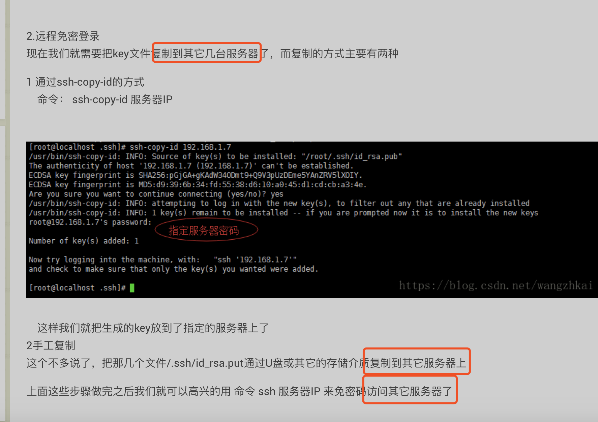
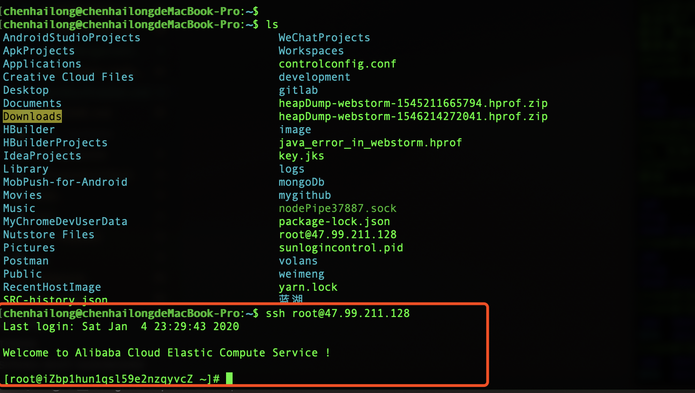

<!--
 * @version: v0.0.1
 * @Author: hailong.chen
 * @Date: 2020-01-04 11:58:15
 * @LastEditors  : hailong.chen
 * @LastEditTime : 2020-01-05 08:29:01
 * @Descripttion: 
 -->
# 5. npmRunPublish

方案1:
[前端自动化部署](https://www.jianshu.com/p/5ec9220d31aa)

方案2:
[gitlab ci 部署vue项目](https://www.jianshu.com/p/6d508eb5edf8)
[Gitlab 持续集成/部署2——持续集成Vue项目](https://my.oschina.net/u/3667677/blog/3051522)

[[后端] gitlab-ci 实现自动部署项目到服务器上](https://www.jianshu.com/p/c566265d39de)


待处理的问题：

1、注册runner并将token填到gitlab
2、runner触发服务端部署，需要服务器无密码启动，需要密钥
[一步一步完成GitLab Runner持续化自动部署](https://blog.csdn.net/shuyuea3/article/details/80699073)
```
4.配置服务器ssh免密码登陆,在脚本中会使用到
在本地服务器创建RSA无密码密钥,并添加远程授权

ssh-keygen -t rsa -P ''
ssh-copy-id root@阿里云部署服务器IP

复制私钥添加到项目变量SSH_PRIVATE_KEY_DEV

cat /root/.ssh/id_rsa

```

[一、首先要配置两台linux如何使用SSH免密码登录，这样脚本执行scp命令以及远程执行脚本都不需要输入密码：](https://www.cnblogs.com/nsh123/p/12143777.html)


```
一、首先要配置两台linux如何使用SSH免密码登录，这样脚本执行scp命令以及远程执行脚本都不需要输入密码：
 A为本地主机(即用于控制其他主机的机器,jenkins服务器) ;
    B为远程主机(即被控制的机器Server，jenkins运行之后发布项目的服务器), 假如ip为10.0.0.10 ;
    A和B的系统都是Linux
   在A上的命令:
    1、 ssh-keygen -t rsa (连续三次回车,即在本地生成了公钥和私钥,不设置密码)
    2、 ssh root@10.0.0.10 "mkdir .ssh;chmod 0700 .ssh" (需要输入密码， 注:必须将.ssh的权限设为700)，如果提示.ssh已经存在，直接ssh root@10.0.0.10  "chmod 0700 .ssh"
    3、scp ~/.ssh/id_rsa.pub root@10.0.0.10:.ssh/id_rsa.pub (需要输入密码)
    在B上的命令:
    4、 touch /root/.ssh/authorized_keys (如果已经存在这个文件, 跳过这条)
    5、 chmod 600 ~/.ssh/authorized_keys  (# 注意： 必须将~/.ssh/authorized_keys的权限改为600, 该文件用于保存ssh客户端生成的公钥，可以修改服务器的ssh服务端配置文件/etc/ssh/sshd_config来指定其他文件名）
    6、cat /root/.ssh/id_rsa.pub  >> /root/.ssh/authorized_keys (将id_rsa.pub的内容追加到 authorized_keys 中, 注意不要用，否则会清空原有的内容，使其他人无法使用原有的密钥登录)
    7、回到A机器:  ssh root@10.0.0.10 (不需要密码, 登录成功)
二、将Jenkins打好的项目scp到目标服务器，执行自己的脚本
    1、 scp /root/.jenkins/workspace/projectA-test/projectA/target/projectA*.war
    root@10.0.0.10:/opt/projectA/webapps/projectA.war，jenkins的workspace下的项目名字根据自己的项目而定
    2、 ssh root@10.0.0.10  /opt/myshell.sh(注意执行远程shell方式，要在ssh root@192.168.1.100之后直接加入要执行目标服务器绝对路径脚本）
```

简述：
1.Linux下生成密钥
生成linux下的密钥要用到 ssh-keygen 命令，一般执行完这个命令公钥和私钥会生成到 .ssh 的隐藏目录。在执行这个命令之前我们先检查一下这个目录是否存在，因为有些linux如果没有这个目录的话是不会生成key的。

然后我们再执行 ssh-keygen -t rsa

进入“.ssh”会生成以下几个文件
id_rsa : 生成的私钥文件 id_rsa.pub ： 生成的公钥文件


2.远程免密登录
现在我们就需要把key文件复制到其它几台服务器了，而复制的方式主要有两种

1 通过ssh-copy-id的方式
　命令： ssh-copy-id 服务器IP

　这样我们就把生成的key放到了指定的服务器上了
2手工复制
这个不多说了，把那几个文件/.ssh/id_rsa.put通过U盘或其它的存储介质复制到其它服务器上

上面这些步骤做完之后我们就可以高兴的用 命令 ssh 服务器IP 来免密码访问其它服务器了


```
Linux配置SSH免密码登录
CentOS配置SSH免密码登录为例
说明：SSH远程登录的安全外壳协议有两种身份认证机制：
- 用户名+密码
-密钥登录
环境准备

host1：192.168.0.10
host2：192.168.0.11
下面以host1 ssh免密码登录到host2为例，进行说明
1、在host1主机下生成私钥/公钥对
执行如下命令一直回车即可。

[user@localhost ~]$ ssh-keygen -t rsa

命令执行完成后，在/home/user下生成.ssh目录，.ssh目录下有id_rsa和id_rsa.pub两个文件。

2、将host1主机下的id_rsa.pub复制到host2主机下
[user@localhost ~]$ scp .ssh/id_rsa.pub user@192.168.0.11:~

此时还没有免密码登录，所以要输入host2的密码

3、host2主机须将复制过来的id_rsa.pub文件中的内容添加到/home/user/.ssh/authorzied_keys文件中
需要修改authorized_keys文件的权限为600

[user@localhost ~]$ cat id_rsa.pub >> .ssh/authorized_keys

[user@localhost ~]$ chmod 600 .ssh/authorized_keys

现在host1主机可以无密码登录host2主机了
说明：第2、3步可以用一个命令搞定：ssh-copy-id 192.168.0.11

4、验证host1主机登录到host2主机
[user@localhost ~]$ ssh 192.168.0.11

总结：登录的机子可有私钥，被登录的机子要有登录机子的公钥。这个公钥/私钥对一般在私钥宿主机产生。
上面是用rsa算法的公钥/私钥对，当然也可以用dsa(对应的文件是id_dsa，id_dsa.pub)
想让host1，host2机无密码互登录，那host2主机以上面同样的方式配置即可。


```


```
id_rsa.pub  存放地址 /root/文档


/home/user/.ssh/authorzied_keys

```

---

### $\color{red}{尝试}$：

#### mac

```sh
Last login: Fri Jan  3 23:25:46 on console
N/A: version "N/A -> N/A" is not yet installed.

You need to run "nvm install N/A" to install it before using it.
N/A: version "N/A -> N/A" is not yet installed.

You need to run "nvm install N/A" to install it before using it.
chenhailong@chenhailongdeMacBook-Pro:~$ ls
AndroidStudioProjects
ApkProjects
Applications
Creative Cloud Files
Desktop
Documents
Downloads
HBuilder
HBuilderProjects
IdeaProjects
Library
MobPush-for-Android
Movies
Music
MyChromeDevUserData
Nutstore Files
Pictures
Postman
Public
RecentHostImage
SRC-history.json
WeChatProjects
Workspaces
controlconfig.conf
development
gitlab
heapDump-webstorm-1545211665794.hprof.zip
heapDump-webstorm-1546214272041.hprof.zip
image
java_error_in_webstorm.hprof
key.jks
logs
mongoDb
mygithub
nodePipe37887.sock
package-lock.json
sunlogincontrol.pid
volans
weimeng
yarn.lock
蓝湖
chenhailong@chenhailongdeMacBook-Pro:~$ cd home
-bash: cd: home: No such file or directory
chenhailong@chenhailongdeMacBook-Pro:~$ cd /
chenhailong@chenhailongdeMacBook-Pro:/$ ls
Applications              cores                     private
Library                   data                      sbin
Network                   dev                       tmp
System                    etc                       usr
Users                     home                      var
Volumes                   installer.failurerequests
bin                       net
chenhailong@chenhailongdeMacBook-Pro:/$ cd home/
chenhailong@chenhailongdeMacBook-Pro:/home$ ls
chenhailong@chenhailongdeMacBook-Pro:/home$ ls
chenhailong@chenhailongdeMacBook-Pro:/home$ ssh-keygen -t rsa
Generating public/private rsa key pair.
Enter file in which to save the key (/Users/chenhailong/.ssh/id_rsa): ^C
chenhailong@chenhailongdeMacBook-Pro:/home$ cd ..
chenhailong@chenhailongdeMacBook-Pro:/$ cd Users/
chenhailong@chenhailongdeMacBook-Pro:/Users$ ls
Guest       Shared      chenhailong
chenhailong@chenhailongdeMacBook-Pro:/Users$ cd chenhailong/
chenhailong@chenhailongdeMacBook-Pro:~$ ls
AndroidStudioProjects
ApkProjects
Applications
Creative Cloud Files
Desktop
Documents
Downloads
HBuilder
HBuilderProjects
IdeaProjects
Library
MobPush-for-Android
Movies
Music
MyChromeDevUserData
Nutstore Files
Pictures
Postman
Public
RecentHostImage
SRC-history.json
WeChatProjects
Workspaces
controlconfig.conf
development
gitlab
heapDump-webstorm-1545211665794.hprof.zip
heapDump-webstorm-1546214272041.hprof.zip
image
java_error_in_webstorm.hprof
key.jks
logs
mongoDb
mygithub
nodePipe37887.sock
package-lock.json
sunlogincontrol.pid
volans
weimeng
yarn.lock
蓝湖
chenhailong@chenhailongdeMacBook-Pro:~$ ls -la
total 292568
drwxr-xr-x+ 159 chenhailong  staff      5088  1  4 16:54 .
drwxr-xr-x    6 root         admin       192 10 19  2018 ..
drwxr-xr-x    3 chenhailong  staff        96  7  9  2018 .ANT_IDE_STUFF
-r--------    1 chenhailong  staff         9  8 20  2017 .CFUserTextEncoding
-rw-r--r--@   1 chenhailong  staff     34820 12 30 20:40 .DS_Store
drwxr-xr-x    3 chenhailong  staff        96  1 14  2018 .Deco
drwxr-xr-x    7 chenhailong  staff       224  5  6  2018 .ShadowsocksX-Free
drwxr-xr-x    8 chenhailong  staff       256  6  7  2018 .ShadowsocksX-NG
drwx------   45 chenhailong  staff      1440  1  4 17:09 .Trash
drwxr-xr-x   23 chenhailong  staff       736  8 18 13:10 .android
-rw-r--r--    1 chenhailong  staff       554  1  3 18:08 .ant-devtool.json
drwxr-xr-x    4 chenhailong  staff       128  5  6  2018 .appcenter-cli
drwxr-xr-x    3 chenhailong  staff        96  3 18  2018 .asciinema
drwxr-xr-x   16 chenhailong  staff       512  7 11  2018 .atom
-rw-r--r--    1 chenhailong  staff         2 12 16 20:12 .babel.7.2.2.development.json
-rw-r--r--    1 chenhailong  staff   8200531 11  6 17:11 .babel.json
-rw-------    1 chenhailong  staff      7819  1  3 18:14 .bash_history
-rw-r--r--@   1 chenhailong  staff      1151  2 20  2019 .bash_profile
-rw-r--r--    1 chenhailong  staff     12288  8 31  2017 .bash_profile.swo
-rw-------@   1 chenhailong  staff     12288  8 21  2017 .bash_profile.swp
drwx------  179 chenhailong  staff      5728  1  4 23:11 .bash_sessions
-rw-r--r--    1 chenhailong  staff       356  9 19 12:45 .bashrc
drwxr-xr-x    3 chenhailong  staff        96 10  5 20:37 .cache
drwxr-xr-x    3 chenhailong  staff        96  5  2  2018 .cocoapods
-rw-r--r--    1 chenhailong  staff       158 10  5 10:40 .code-push.config
drwxr-xr-x    6 chenhailong  staff       192  9  3  2017 .config
drwx------    3 chenhailong  staff        96 11 25  2017 .cups
drwxr-xr-x    3 chenhailong  staff        96  6  1  2018 .dart
drwxr-xr-x    4 chenhailong  staff       128  6  1  2018 .dartServer
-rw-------    1 chenhailong  staff         0  6 30  2018 .dbshell
-rw-r--r--    1 chenhailong  staff       143  9 15  2017 .deliverycenter.installs
-rw-r--r--    1 chenhailong  staff        65  9 15  2017 .deliverycenter.system
drwxr-xr-x    5 chenhailong  staff       160 11 16  2018 .docker
drwxr-xr-x    4 chenhailong  staff       128 11 17  2018 .downloader
drwxr-xr-x   14 chenhailong  staff       448  9 15  2017 .eclipse
drwxr-xr-x    3 chenhailong  staff        96 10  6 10:37 .eeui
drwxr-xr-x   25 chenhailong  staff       800  9  4 15:45 .electron
-rw-------    1 chenhailong  staff        16 10 18  2017 .emulator_console_auth_token
-rw-r--r--    1 chenhailong  staff       118 10 28  2018 .ew.json
drwxr-xr-x   13 chenhailong  staff       416  8 15  2018 .expo
drwxr-xr-x    4 chenhailong  staff       128  1  1 12:08 .fancy
drwxr-xr-x    5 chenhailong  staff       160  6 29  2019 .flipper
drwxr-xr-x    3 chenhailong  staff        96 10 29  2018 .flow-typed
-rw-r--r--    1 chenhailong  staff        78  6  1  2018 .flutter
-rw-r--r--    1 chenhailong  staff        85  7 27 18:35 .flutter_settings
drwxr-xr-x   10 chenhailong  staff       320  7 17  2018 .forever
drwxr-xr-x    3 chenhailong  staff        96  5  7  2018 .gem
drwxr-xr-x    3 chenhailong  staff        96  1 22  2018 .gitbook
-rw-r--r--    1 chenhailong  staff       422  5 28  2019 .gitconfig
-rw-r--r--    1 chenhailong  staff        13  9  1  2017 .gitignore_global
drwxr-xr-x    6 chenhailong  staff       192  6  3  2019 .gitnote
drwxr-xr-x    9 chenhailong  staff       288  2 12  2019 .gradle
-rw-r--r--    1 chenhailong  staff        27  9  1  2017 .hgignore_global
drwxr-xr-x    3 chenhailong  staff        96 12 31  2018 .ice-templates
drwxr-xr-x    4 chenhailong  staff       128 12 23  2018 .iceworks
drwxr-xr-x    6 chenhailong  staff       192 11 14  2017 .ionic
drwxr-xr-x   17 chenhailong  staff       544 11  5  2018 .itmstransporter
drwxr-xr-x    8 chenhailong  staff       256 12  5 16:50 .kaitian
drwxr-xr-x    4 chenhailong  staff       128  1 21  2019 .kingsoft
drwxr-xr-x    3 chenhailong  staff        96  9  3  2017 .local
drwxr-xr-x    4 chenhailong  staff       128 11  1 14:20 .lsp4xml
drwxr-xr-x    5 chenhailong  staff       160  2  3  2018 .m2
drwxr-xr-x   30 chenhailong  staff       960  8 10 11:49 .markdownNavigator
-rw-------    1 chenhailong  staff         0  6 30  2018 .mongorc.js
drwxr-xr-x    5 chenhailong  staff       160 11 25  2017 .myeclipse
-rw-r--r--    1 chenhailong  staff       126 11 25  2017 .myeclipse.properties
-rw-------    1 chenhailong  staff     45281  4 12  2019 .mysql_history
drwxr-xr-x    8 chenhailong  staff       256  7 29 19:30 .node-gyp
-rw-------    1 chenhailong  staff      2273 10 12 23:41 .node_repl_history
drwxr-xr-x  417 chenhailong  staff     13344 12 28 23:00 .npm
drwxr-xr-x   35 chenhailong  staff      1120 11  6  2018 .npminstall_tarball
-rw-------    1 chenhailong  staff       283 12 31  2018 .npmrc
drwxr-xr-x    9 chenhailong  staff       288 12 25  2018 .nutstore
-rw-r--r--    1 chenhailong  staff        43 10 11  2017 .nuuid.ini
drwxr-xr-x   26 chenhailong  staff       832 11 13  2017 .nvm
drwxr-xr-x    8 chenhailong  staff       256 10  2  2018 .oracle_jre_usage
drwxr-xr-x    8 chenhailong  staff       256  9 10  2017 .p2
-rw-------    1 chenhailong  staff        65 10  6 08:48 .pgAdmin4.9731491707523589030.addr
-rw-------    1 chenhailong  staff   5665195 10  6 21:41 .pgAdmin4.9731491707523589030.log
-rw-------    1 chenhailong  staff      1688 10  6 08:48 .pgAdmin4.startup.log
drwx------    6 chenhailong  staff       192 10  6 09:07 .pgadmin
drwxr-xr-x    6 chenhailong  staff       192  6 16  2019 .pub-cache
drwx------    3 chenhailong  staff        96  5 30  2018 .putty
drwxr-xr-x    2 chenhailong  staff        64  6  5  2019 .quicktype-vscode
drwxr-xr-x    3 chenhailong  staff        96  7 26 16:04 .react-native-cli
-rw-------    1 chenhailong  staff      2068  5 12  2018 .rediscli_history
drwxr-xr-x    6 chenhailong  staff       192  7  6  2019 .rest-client
drwxr-xr-x   10 chenhailong  staff       320  6  5  2019 .rncache
-rw-r--r--    1 chenhailong  staff         5  9 26 14:56 .rndebugger_port
-rw-r--r--@   1 chenhailong  staff      1363 10 10  2018 .rndebuggerrc
drwx------    6 chenhailong  staff       192  2 16  2019 .ssh
-rw-r--r--@   1 chenhailong  staff         0 12 21  2017 .stCommitMsg
-rw-r--r--    1 chenhailong  staff        57  7  2  2019 .stagehand
drwxr-xr-x    3 chenhailong  staff        96  7  6  2019 .sts4
drwxr-xr-x    6 chenhailong  staff       192 10 21  2017 .subversion
drwxr-xr-x    3 chenhailong  staff        96  9 28  2017 .swt
drwxr-xr-x    3 chenhailong  staff        96  8 29  2017 .tooling
drwxr--r--    3 chenhailong  staff        96  8 20  2018 .tsd-cache
drwxr-xr-x    3 chenhailong  staff        96 10 15 13:04 .umi
-rw-r--r--    1 chenhailong  staff      9350  8 19  2018 .v8flags.6.2.414.50.6ec70d0636ab9d1b54fac67a0f1b0db7.json
-rw-r--r--    1 chenhailong  staff      4385  8 21  2018 .v8flags.6.7.288.49-node.19.6ec70d0636ab9d1b54fac67a0f1b0db7.json
-rw-r--r--    1 chenhailong  staff      4397  9  7 10:41 .v8flags.6.8.275.32-node.36.6ec70d0636ab9d1b54fac67a0f1b0db7.json
-rw-------    1 chenhailong  staff     18376 12 26 15:35 .viminfo
drwxr-xr-x    5 chenhailong  staff       160 11 11 09:13 .vscode
drwxr-xr-x    3 chenhailong  staff        96  7 26 18:10 .vscode-react-native
drwxr-xr-x    4 chenhailong  staff       128 10 11 12:32 .vue-cli-ui
drwxr-xr-x    5 chenhailong  staff       160  9 19 13:27 .vue-templates
-rw-r--r--    1 chenhailong  staff       459 12 30 23:13 .vuerc
drwxr-xr-x    3 chenhailong  staff        96  7 16  2018 .vuxrc
drwxr-xr-x    4 chenhailong  staff       128 11 25  2017 .webclipse
drwxr-xr-x    3 chenhailong  staff        96 11 11  2018 .wepy_templates
drwxr-xr-x    3 chenhailong  staff        96  5 12  2018 .wns
drwxr-xr-x    5 chenhailong  staff       160  9 13 22:14 .wx
-rw-r--r--    1 chenhailong  staff       197 12 31 09:29 .yarnrc
-rw-r--r--    1 chenhailong  staff     40595  9  1  2018 .zcompdump-陈海龙的MacBook Pro-5.3
drwxr-xr-x    9 chenhailong  staff       288 11 13  2017 .zsh-nvm
-rw-------    1 chenhailong  staff     12198  9  4  2018 .zsh_history
-rw-r--r--    1 chenhailong  staff      3540  9  4  2018 .zshrc
drwxr-xr-x    4 chenhailong  staff       128  4 22  2018 AndroidStudioProjects
drwxr-xr-x    6 chenhailong  staff       192  7 25 13:42 ApkProjects
drwx------@   9 chenhailong  staff       288  6  9  2018 Applications
drwxrwxr-x@   5 chenhailong  staff       160  7 27 09:56 Creative Cloud Files
drwx------@  33 chenhailong  staff      1056  1  3 15:03 Desktop
drwx------@  38 chenhailong  staff      1216  7 26 21:21 Documents
drwxrwxrwx+  19 chenhailong  staff       608 12 31 18:28 Downloads
drwxr-xr-x    5 chenhailong  staff       160  9 28  2017 HBuilder
drwxr-xr-x   10 chenhailong  staff       320 10 14  2017 HBuilderProjects
drwxr-xr-x   13 chenhailong  staff       416  4 15  2018 IdeaProjects
drwx------@  95 chenhailong  staff      3040 12 31 18:42 Library
drwxr-xr-x   10 chenhailong  staff       320  2 15  2019 MobPush-for-Android
drwx------+   4 chenhailong  staff       128  8 25  2017 Movies
drwx------+   7 chenhailong  staff       224  8 26  2017 Music
drwx------   24 chenhailong  staff       768 10 31 15:56 MyChromeDevUserData
drwxr-xr-x    3 chenhailong  staff        96  2 22  2019 Nutstore Files
drwx------+   9 chenhailong  staff       288  8  3 23:07 Pictures
drwxr-xr-x    3 chenhailong  staff        96 11 18 10:43 Postman
drwxr-xr-x+   6 chenhailong  staff       192  8 20  2017 Public
drwxr-xr-x    8 chenhailong  staff       256  1  4 20:24 RecentHostImage
-rw-r--r--    1 chenhailong  staff       271  7  6  2019 SRC-history.json
drwxr-xr-x    3 chenhailong  staff        96  5 26  2019 WeChatProjects
drwxr-xr-x    3 chenhailong  staff        96 11 25  2017 Workspaces
-rw-r--r--    1 chenhailong  staff       673  1  4 16:54 controlconfig.conf
drwxr-xr-x   13 chenhailong  staff       416  1  4 09:52 development
drwxr-xr-x    3 chenhailong  staff        96 11 28 22:46 gitlab
-rw-r--r--    1 chenhailong  staff  67690820 12 19  2018 heapDump-webstorm-1545211665794.hprof.zip
-rw-r--r--    1 chenhailong  staff  24358720 12 31  2018 heapDump-webstorm-1546214272041.hprof.zip
drwxr-xr-x    4 chenhailong  staff       128 12 27 10:50 image
-rw-------    1 chenhailong  staff  41942895  6 10  2019 java_error_in_webstorm.hprof
-rw-r--r--    1 chenhailong  staff      2188  2 24  2019 key.jks
drwxr-xr-x    4 chenhailong  staff       128 11  2 07:33 logs
drwxr-xr-x   10 chenhailong  staff       320  8 21  2017 mongoDb
drwxr-xr-x   10 chenhailong  staff       320  1  4 17:09 mygithub
srwxr-xr-x    1 chenhailong  staff         0  8  2  2018 nodePipe37887.sock
-rw-r--r--    1 chenhailong  staff        27 11 11  2017 package-lock.json
-rw-r--r--    1 chenhailong  staff         0 12 27 16:17 sunlogincontrol.pid
drwxr-xr-x    3 chenhailong  staff        96 12  1  2018 volans
drwxr-xr-x   26 chenhailong  staff       832  1  3 13:27 weimeng
-rw-r--r--    1 chenhailong  staff        86  8 21  2017 yarn.lock
drwxr-xr-x    4 chenhailong  staff       128 10 30 08:43 蓝湖
chenhailong@chenhailongdeMacBook-Pro:~$ ls
AndroidStudioProjects                     WeChatProjects
ApkProjects                               Workspaces
Applications                              controlconfig.conf
Creative Cloud Files                      development
Desktop                                   gitlab
Documents                                 heapDump-webstorm-1545211665794.hprof.zip
Downloads                                 heapDump-webstorm-1546214272041.hprof.zip
HBuilder                                  image
HBuilderProjects                          java_error_in_webstorm.hprof
IdeaProjects                              key.jks
Library                                   logs
MobPush-for-Android                       mongoDb
Movies                                    mygithub
Music                                     nodePipe37887.sock
MyChromeDevUserData                       package-lock.json
Nutstore Files                            sunlogincontrol.pid
Pictures                                  volans
Postman                                   weimeng
Public                                    yarn.lock
RecentHostImage                           蓝湖
SRC-history.json
chenhailong@chenhailongdeMacBook-Pro:~$ cd /
chenhailong@chenhailongdeMacBook-Pro:/$ ls
Applications              Volumes                   etc                       sbin
Library                   bin                       home                      tmp
Network                   cores                     installer.failurerequests usr
System                    data                      net                       var
Users                     dev                       private
chenhailong@chenhailongdeMacBook-Pro:/$ cd Users/
chenhailong@chenhailongdeMacBook-Pro:/Users$ ls
Guest       Shared      chenhailong
chenhailong@chenhailongdeMacBook-Pro:/Users$ cd chenhailong/
chenhailong@chenhailongdeMacBook-Pro:~$ ls
AndroidStudioProjects                     WeChatProjects
ApkProjects                               Workspaces
Applications                              controlconfig.conf
Creative Cloud Files                      development
Desktop                                   gitlab
Documents                                 heapDump-webstorm-1545211665794.hprof.zip
Downloads                                 heapDump-webstorm-1546214272041.hprof.zip
HBuilder                                  image
HBuilderProjects                          java_error_in_webstorm.hprof
IdeaProjects                              key.jks
Library                                   logs
MobPush-for-Android                       mongoDb
Movies                                    mygithub
Music                                     nodePipe37887.sock
MyChromeDevUserData                       package-lock.json
Nutstore Files                            sunlogincontrol.pid
Pictures                                  volans
Postman                                   weimeng
Public                                    yarn.lock
RecentHostImage                           蓝湖
SRC-history.json
chenhailong@chenhailongdeMacBook-Pro:~$ ls -la
total 292568
drwxr-xr-x+ 159 chenhailong  staff      5088  1  4 16:54 .
drwxr-xr-x    6 root         admin       192 10 19  2018 ..
drwxr-xr-x    3 chenhailong  staff        96  7  9  2018 .ANT_IDE_STUFF
-r--------    1 chenhailong  staff         9  8 20  2017 .CFUserTextEncoding
-rw-r--r--@   1 chenhailong  staff     34820 12 30 20:40 .DS_Store
drwxr-xr-x    3 chenhailong  staff        96  1 14  2018 .Deco
drwxr-xr-x    7 chenhailong  staff       224  5  6  2018 .ShadowsocksX-Free
drwxr-xr-x    8 chenhailong  staff       256  6  7  2018 .ShadowsocksX-NG
drwx------   45 chenhailong  staff      1440  1  4 17:09 .Trash
drwxr-xr-x   23 chenhailong  staff       736  8 18 13:10 .android
-rw-r--r--    1 chenhailong  staff       554  1  3 18:08 .ant-devtool.json
drwxr-xr-x    4 chenhailong  staff       128  5  6  2018 .appcenter-cli
drwxr-xr-x    3 chenhailong  staff        96  3 18  2018 .asciinema
drwxr-xr-x   16 chenhailong  staff       512  7 11  2018 .atom
-rw-r--r--    1 chenhailong  staff         2 12 16 20:12 .babel.7.2.2.development.json
-rw-r--r--    1 chenhailong  staff   8200531 11  6 17:11 .babel.json
-rw-------    1 chenhailong  staff      7819  1  3 18:14 .bash_history
-rw-r--r--@   1 chenhailong  staff      1151  2 20  2019 .bash_profile
-rw-r--r--    1 chenhailong  staff     12288  8 31  2017 .bash_profile.swo
-rw-------@   1 chenhailong  staff     12288  8 21  2017 .bash_profile.swp
drwx------  179 chenhailong  staff      5728  1  4 23:11 .bash_sessions
-rw-r--r--    1 chenhailong  staff       356  9 19 12:45 .bashrc
drwxr-xr-x    3 chenhailong  staff        96 10  5 20:37 .cache
drwxr-xr-x    3 chenhailong  staff        96  5  2  2018 .cocoapods
-rw-r--r--    1 chenhailong  staff       158 10  5 10:40 .code-push.config
drwxr-xr-x    6 chenhailong  staff       192  9  3  2017 .config
drwx------    3 chenhailong  staff        96 11 25  2017 .cups
drwxr-xr-x    3 chenhailong  staff        96  6  1  2018 .dart
drwxr-xr-x    4 chenhailong  staff       128  6  1  2018 .dartServer
-rw-------    1 chenhailong  staff         0  6 30  2018 .dbshell
-rw-r--r--    1 chenhailong  staff       143  9 15  2017 .deliverycenter.installs
-rw-r--r--    1 chenhailong  staff        65  9 15  2017 .deliverycenter.system
drwxr-xr-x    5 chenhailong  staff       160 11 16  2018 .docker
drwxr-xr-x    4 chenhailong  staff       128 11 17  2018 .downloader
drwxr-xr-x   14 chenhailong  staff       448  9 15  2017 .eclipse
drwxr-xr-x    3 chenhailong  staff        96 10  6 10:37 .eeui
drwxr-xr-x   25 chenhailong  staff       800  9  4 15:45 .electron
-rw-------    1 chenhailong  staff        16 10 18  2017 .emulator_console_auth_token
-rw-r--r--    1 chenhailong  staff       118 10 28  2018 .ew.json
drwxr-xr-x   13 chenhailong  staff       416  8 15  2018 .expo
drwxr-xr-x    4 chenhailong  staff       128  1  1 12:08 .fancy
drwxr-xr-x    5 chenhailong  staff       160  6 29  2019 .flipper
drwxr-xr-x    3 chenhailong  staff        96 10 29  2018 .flow-typed
-rw-r--r--    1 chenhailong  staff        78  6  1  2018 .flutter
-rw-r--r--    1 chenhailong  staff        85  7 27 18:35 .flutter_settings
drwxr-xr-x   10 chenhailong  staff       320  7 17  2018 .forever
drwxr-xr-x    3 chenhailong  staff        96  5  7  2018 .gem
drwxr-xr-x    3 chenhailong  staff        96  1 22  2018 .gitbook
-rw-r--r--    1 chenhailong  staff       422  5 28  2019 .gitconfig
-rw-r--r--    1 chenhailong  staff        13  9  1  2017 .gitignore_global
drwxr-xr-x    6 chenhailong  staff       192  6  3  2019 .gitnote
drwxr-xr-x    9 chenhailong  staff       288  2 12  2019 .gradle
-rw-r--r--    1 chenhailong  staff        27  9  1  2017 .hgignore_global
drwxr-xr-x    3 chenhailong  staff        96 12 31  2018 .ice-templates
drwxr-xr-x    4 chenhailong  staff       128 12 23  2018 .iceworks
drwxr-xr-x    6 chenhailong  staff       192 11 14  2017 .ionic
drwxr-xr-x   17 chenhailong  staff       544 11  5  2018 .itmstransporter
drwxr-xr-x    8 chenhailong  staff       256 12  5 16:50 .kaitian
drwxr-xr-x    4 chenhailong  staff       128  1 21  2019 .kingsoft
drwxr-xr-x    3 chenhailong  staff        96  9  3  2017 .local
drwxr-xr-x    4 chenhailong  staff       128 11  1 14:20 .lsp4xml
drwxr-xr-x    5 chenhailong  staff       160  2  3  2018 .m2
drwxr-xr-x   30 chenhailong  staff       960  8 10 11:49 .markdownNavigator
-rw-------    1 chenhailong  staff         0  6 30  2018 .mongorc.js
drwxr-xr-x    5 chenhailong  staff       160 11 25  2017 .myeclipse
-rw-r--r--    1 chenhailong  staff       126 11 25  2017 .myeclipse.properties
-rw-------    1 chenhailong  staff     45281  4 12  2019 .mysql_history
drwxr-xr-x    8 chenhailong  staff       256  7 29 19:30 .node-gyp
-rw-------    1 chenhailong  staff      2273 10 12 23:41 .node_repl_history
drwxr-xr-x  417 chenhailong  staff     13344 12 28 23:00 .npm
drwxr-xr-x   35 chenhailong  staff      1120 11  6  2018 .npminstall_tarball
-rw-------    1 chenhailong  staff       283 12 31  2018 .npmrc
drwxr-xr-x    9 chenhailong  staff       288 12 25  2018 .nutstore
-rw-r--r--    1 chenhailong  staff        43 10 11  2017 .nuuid.ini
drwxr-xr-x   26 chenhailong  staff       832 11 13  2017 .nvm
drwxr-xr-x    8 chenhailong  staff       256 10  2  2018 .oracle_jre_usage
drwxr-xr-x    8 chenhailong  staff       256  9 10  2017 .p2
-rw-------    1 chenhailong  staff        65 10  6 08:48 .pgAdmin4.9731491707523589030.addr
-rw-------    1 chenhailong  staff   5665195 10  6 21:41 .pgAdmin4.9731491707523589030.log
-rw-------    1 chenhailong  staff      1688 10  6 08:48 .pgAdmin4.startup.log
drwx------    6 chenhailong  staff       192 10  6 09:07 .pgadmin
drwxr-xr-x    6 chenhailong  staff       192  6 16  2019 .pub-cache
drwx------    3 chenhailong  staff        96  5 30  2018 .putty
drwxr-xr-x    2 chenhailong  staff        64  6  5  2019 .quicktype-vscode
drwxr-xr-x    3 chenhailong  staff        96  7 26 16:04 .react-native-cli
-rw-------    1 chenhailong  staff      2068  5 12  2018 .rediscli_history
drwxr-xr-x    6 chenhailong  staff       192  7  6  2019 .rest-client
drwxr-xr-x   10 chenhailong  staff       320  6  5  2019 .rncache
-rw-r--r--    1 chenhailong  staff         5  9 26 14:56 .rndebugger_port
-rw-r--r--@   1 chenhailong  staff      1363 10 10  2018 .rndebuggerrc
drwx------    6 chenhailong  staff       192  2 16  2019 .ssh
-rw-r--r--@   1 chenhailong  staff         0 12 21  2017 .stCommitMsg
-rw-r--r--    1 chenhailong  staff        57  7  2  2019 .stagehand
drwxr-xr-x    3 chenhailong  staff        96  7  6  2019 .sts4
drwxr-xr-x    6 chenhailong  staff       192 10 21  2017 .subversion
drwxr-xr-x    3 chenhailong  staff        96  9 28  2017 .swt
drwxr-xr-x    3 chenhailong  staff        96  8 29  2017 .tooling
drwxr--r--    3 chenhailong  staff        96  8 20  2018 .tsd-cache
drwxr-xr-x    3 chenhailong  staff        96 10 15 13:04 .umi
-rw-r--r--    1 chenhailong  staff      9350  8 19  2018 .v8flags.6.2.414.50.6ec70d0636ab9d1b54fac67a0f1b0db7.json
-rw-r--r--    1 chenhailong  staff      4385  8 21  2018 .v8flags.6.7.288.49-node.19.6ec70d0636ab9d1b54fac67a0f1b0db7.json
-rw-r--r--    1 chenhailong  staff      4397  9  7 10:41 .v8flags.6.8.275.32-node.36.6ec70d0636ab9d1b54fac67a0f1b0db7.json
-rw-------    1 chenhailong  staff     18376 12 26 15:35 .viminfo
drwxr-xr-x    5 chenhailong  staff       160 11 11 09:13 .vscode
drwxr-xr-x    3 chenhailong  staff        96  7 26 18:10 .vscode-react-native
drwxr-xr-x    4 chenhailong  staff       128 10 11 12:32 .vue-cli-ui
drwxr-xr-x    5 chenhailong  staff       160  9 19 13:27 .vue-templates
-rw-r--r--    1 chenhailong  staff       459 12 30 23:13 .vuerc
drwxr-xr-x    3 chenhailong  staff        96  7 16  2018 .vuxrc
drwxr-xr-x    4 chenhailong  staff       128 11 25  2017 .webclipse
drwxr-xr-x    3 chenhailong  staff        96 11 11  2018 .wepy_templates
drwxr-xr-x    3 chenhailong  staff        96  5 12  2018 .wns
drwxr-xr-x    5 chenhailong  staff       160  9 13 22:14 .wx
-rw-r--r--    1 chenhailong  staff       197 12 31 09:29 .yarnrc
-rw-r--r--    1 chenhailong  staff     40595  9  1  2018 .zcompdump-陈海龙的MacBook Pro-5.3
drwxr-xr-x    9 chenhailong  staff       288 11 13  2017 .zsh-nvm
-rw-------    1 chenhailong  staff     12198  9  4  2018 .zsh_history
-rw-r--r--    1 chenhailong  staff      3540  9  4  2018 .zshrc
drwxr-xr-x    4 chenhailong  staff       128  4 22  2018 AndroidStudioProjects
drwxr-xr-x    6 chenhailong  staff       192  7 25 13:42 ApkProjects
drwx------@   9 chenhailong  staff       288  6  9  2018 Applications
drwxrwxr-x@   5 chenhailong  staff       160  7 27 09:56 Creative Cloud Files
drwx------@  33 chenhailong  staff      1056  1  3 15:03 Desktop
drwx------@  38 chenhailong  staff      1216  7 26 21:21 Documents
drwxrwxrwx+  19 chenhailong  staff       608 12 31 18:28 Downloads
drwxr-xr-x    5 chenhailong  staff       160  9 28  2017 HBuilder
drwxr-xr-x   10 chenhailong  staff       320 10 14  2017 HBuilderProjects
drwxr-xr-x   13 chenhailong  staff       416  4 15  2018 IdeaProjects
drwx------@  95 chenhailong  staff      3040 12 31 18:42 Library
drwxr-xr-x   10 chenhailong  staff       320  2 15  2019 MobPush-for-Android
drwx------+   4 chenhailong  staff       128  8 25  2017 Movies
drwx------+   7 chenhailong  staff       224  8 26  2017 Music
drwx------   24 chenhailong  staff       768 10 31 15:56 MyChromeDevUserData
drwxr-xr-x    3 chenhailong  staff        96  2 22  2019 Nutstore Files
drwx------+   9 chenhailong  staff       288  8  3 23:07 Pictures
drwxr-xr-x    3 chenhailong  staff        96 11 18 10:43 Postman
drwxr-xr-x+   6 chenhailong  staff       192  8 20  2017 Public
drwxr-xr-x    8 chenhailong  staff       256  1  4 20:24 RecentHostImage
-rw-r--r--    1 chenhailong  staff       271  7  6  2019 SRC-history.json
drwxr-xr-x    3 chenhailong  staff        96  5 26  2019 WeChatProjects
drwxr-xr-x    3 chenhailong  staff        96 11 25  2017 Workspaces
-rw-r--r--    1 chenhailong  staff       673  1  4 16:54 controlconfig.conf
drwxr-xr-x   13 chenhailong  staff       416  1  4 09:52 development
drwxr-xr-x    3 chenhailong  staff        96 11 28 22:46 gitlab
-rw-r--r--    1 chenhailong  staff  67690820 12 19  2018 heapDump-webstorm-1545211665794.hprof.zip
-rw-r--r--    1 chenhailong  staff  24358720 12 31  2018 heapDump-webstorm-1546214272041.hprof.zip
drwxr-xr-x    4 chenhailong  staff       128 12 27 10:50 image
-rw-------    1 chenhailong  staff  41942895  6 10  2019 java_error_in_webstorm.hprof
-rw-r--r--    1 chenhailong  staff      2188  2 24  2019 key.jks
drwxr-xr-x    4 chenhailong  staff       128 11  2 07:33 logs
drwxr-xr-x   10 chenhailong  staff       320  8 21  2017 mongoDb
drwxr-xr-x   10 chenhailong  staff       320  1  4 17:09 mygithub
srwxr-xr-x    1 chenhailong  staff         0  8  2  2018 nodePipe37887.sock
-rw-r--r--    1 chenhailong  staff        27 11 11  2017 package-lock.json
-rw-r--r--    1 chenhailong  staff         0 12 27 16:17 sunlogincontrol.pid
drwxr-xr-x    3 chenhailong  staff        96 12  1  2018 volans
drwxr-xr-x   26 chenhailong  staff       832  1  3 13:27 weimeng
-rw-r--r--    1 chenhailong  staff        86  8 21  2017 yarn.lock
drwxr-xr-x    4 chenhailong  staff       128 10 30 08:43 蓝湖
chenhailong@chenhailongdeMacBook-Pro:~$ cd .ssh/
chenhailong@chenhailongdeMacBook-Pro:~/.ssh$ ls
id_rsa          id_rsa.pub      known_hosts     known_hosts.old
chenhailong@chenhailongdeMacBook-Pro:~/.ssh$ ssh-copy-id 47.99.211.128
/usr/bin/ssh-copy-id: INFO: Source of key(s) to be installed: "/Users/chenhailong/.ssh/id_rsa.pub"
/usr/bin/ssh-copy-id: INFO: attempting to log in with the new key(s), to filter out any that are already installed
/usr/bin/ssh-copy-id: INFO: 1 key(s) remain to be installed -- if you are prompted now it is to install the new keys
chenhailong@47.99.211.128's password: 
Permission denied, please try again.
chenhailong@47.99.211.128's password: 
Permission denied, please try again.
chenhailong@47.99.211.128's password: 
chenhailong@47.99.211.128: Permission denied (publickey,gssapi-keyex,gssapi-with-mic,password).
chenhailong@chenhailongdeMacBook-Pro:~/.ssh$ ssh-copy-id 47.99.211.128
/usr/bin/ssh-copy-id: INFO: Source of key(s) to be installed: "/Users/chenhailong/.ssh/id_rsa.pub"
/usr/bin/ssh-copy-id: INFO: attempting to log in with the new key(s), to filter out any that are already installed
/usr/bin/ssh-copy-id: INFO: 1 key(s) remain to be installed -- if you are prompted now it is to install the new keys
chenhailong@47.99.211.128's password: 
Permission denied, please try again.
chenhailong@47.99.211.128's password: 
Permission denied, please try again.
chenhailong@47.99.211.128's password: 
chenhailong@47.99.211.128: Permission denied (publickey,gssapi-keyex,gssapi-with-mic,password).
chenhailong@chenhailongdeMacBook-Pro:~/.ssh$ 
chenhailong@chenhailongdeMacBook-Pro:~/.ssh$ whoami
chenhailong
chenhailong@chenhailongdeMacBook-Pro:~/.ssh$ ssh-copy-id 47.99.211.128
/usr/bin/ssh-copy-id: INFO: Source of key(s) to be installed: "/Users/chenhailong/.ssh/id_rsa.pub"
/usr/bin/ssh-copy-id: INFO: attempting to log in with the new key(s), to filter out any that are already installed
/usr/bin/ssh-copy-id: INFO: 1 key(s) remain to be installed -- if you are prompted now it is to install the new keys
chenhailong@47.99.211.128's password: 
Permission denied, please try again.
chenhailong@47.99.211.128's password: 
Permission denied, please try again.
chenhailong@47.99.211.128's password: 
Connection closed by 47.99.211.128 port 22
chenhailong@chenhailongdeMacBook-Pro:~/.ssh$ ssh-copy-id 47.99.211.128
/usr/bin/ssh-copy-id: INFO: Source of key(s) to be installed: "/Users/chenhailong/.ssh/id_rsa.pub"
/usr/bin/ssh-copy-id: INFO: attempting to log in with the new key(s), to filter out any that are already installed
/usr/bin/ssh-copy-id: INFO: 1 key(s) remain to be installed -- if you are prompted now it is to install the new keys
chenhailong@47.99.211.128's password: 
mkdir: 无法创建目录".ssh": 设备上没有空间
chenhailong@chenhailongdeMacBook-Pro:~/.ssh$ ls
id_rsa          id_rsa.pub      known_hosts     known_hosts.old
chenhailong@chenhailongdeMacBook-Pro:~/.ssh$ cd ..
chenhailong@chenhailongdeMacBook-Pro:~$ scp .ssh/id_rsa.pub root@47.99.211.128
chenhailong@chenhailongdeMacBook-Pro:~$ ls
AndroidStudioProjects                     WeChatProjects
ApkProjects                               Workspaces
Applications                              controlconfig.conf
Creative Cloud Files                      development
Desktop                                   gitlab
Documents                                 heapDump-webstorm-1545211665794.hprof.zip
Downloads                                 heapDump-webstorm-1546214272041.hprof.zip
HBuilder                                  image
HBuilderProjects                          java_error_in_webstorm.hprof
IdeaProjects                              key.jks
Library                                   logs
MobPush-for-Android                       mongoDb
Movies                                    mygithub
Music                                     nodePipe37887.sock
MyChromeDevUserData                       package-lock.json
Nutstore Files                            root@47.99.211.128
Pictures                                  sunlogincontrol.pid
Postman                                   volans
Public                                    weimeng
RecentHostImage                           yarn.lock
SRC-history.json                          蓝湖
chenhailong@chenhailongdeMacBook-Pro:~$ ls -la
total 292576
drwxr-xr-x+ 160 chenhailong  staff      5120  1  4 23:30 .
drwxr-xr-x    6 root         admin       192 10 19  2018 ..
drwxr-xr-x    3 chenhailong  staff        96  7  9  2018 .ANT_IDE_STUFF
-r--------    1 chenhailong  staff         9  8 20  2017 .CFUserTextEncoding
-rw-r--r--@   1 chenhailong  staff     34820 12 30 20:40 .DS_Store
drwxr-xr-x    3 chenhailong  staff        96  1 14  2018 .Deco
drwxr-xr-x    7 chenhailong  staff       224  5  6  2018 .ShadowsocksX-Free
drwxr-xr-x    8 chenhailong  staff       256  6  7  2018 .ShadowsocksX-NG
drwx------   45 chenhailong  staff      1440  1  4 17:09 .Trash
drwxr-xr-x   23 chenhailong  staff       736  8 18 13:10 .android
-rw-r--r--    1 chenhailong  staff       554  1  3 18:08 .ant-devtool.json
drwxr-xr-x    4 chenhailong  staff       128  5  6  2018 .appcenter-cli
drwxr-xr-x    3 chenhailong  staff        96  3 18  2018 .asciinema
drwxr-xr-x   16 chenhailong  staff       512  7 11  2018 .atom
-rw-r--r--    1 chenhailong  staff         2 12 16 20:12 .babel.7.2.2.development.json
-rw-r--r--    1 chenhailong  staff   8200531 11  6 17:11 .babel.json
-rw-------    1 chenhailong  staff      7819  1  3 18:14 .bash_history
-rw-r--r--@   1 chenhailong  staff      1151  2 20  2019 .bash_profile
-rw-r--r--    1 chenhailong  staff     12288  8 31  2017 .bash_profile.swo
-rw-------@   1 chenhailong  staff     12288  8 21  2017 .bash_profile.swp
drwx------  180 chenhailong  staff      5760  1  4 23:22 .bash_sessions
-rw-r--r--    1 chenhailong  staff       356  9 19 12:45 .bashrc
drwxr-xr-x    3 chenhailong  staff        96 10  5 20:37 .cache
drwxr-xr-x    3 chenhailong  staff        96  5  2  2018 .cocoapods
-rw-r--r--    1 chenhailong  staff       158 10  5 10:40 .code-push.config
drwxr-xr-x    6 chenhailong  staff       192  9  3  2017 .config
drwx------    3 chenhailong  staff        96 11 25  2017 .cups
drwxr-xr-x    3 chenhailong  staff        96  6  1  2018 .dart
drwxr-xr-x    4 chenhailong  staff       128  6  1  2018 .dartServer
-rw-------    1 chenhailong  staff         0  6 30  2018 .dbshell
-rw-r--r--    1 chenhailong  staff       143  9 15  2017 .deliverycenter.installs
-rw-r--r--    1 chenhailong  staff        65  9 15  2017 .deliverycenter.system
drwxr-xr-x    5 chenhailong  staff       160 11 16  2018 .docker
drwxr-xr-x    4 chenhailong  staff       128 11 17  2018 .downloader
drwxr-xr-x   14 chenhailong  staff       448  9 15  2017 .eclipse
drwxr-xr-x    3 chenhailong  staff        96 10  6 10:37 .eeui
drwxr-xr-x   25 chenhailong  staff       800  9  4 15:45 .electron
-rw-------    1 chenhailong  staff        16 10 18  2017 .emulator_console_auth_token
-rw-r--r--    1 chenhailong  staff       118 10 28  2018 .ew.json
drwxr-xr-x   13 chenhailong  staff       416  8 15  2018 .expo
drwxr-xr-x    4 chenhailong  staff       128  1  1 12:08 .fancy
drwxr-xr-x    5 chenhailong  staff       160  6 29  2019 .flipper
drwxr-xr-x    3 chenhailong  staff        96 10 29  2018 .flow-typed
-rw-r--r--    1 chenhailong  staff        78  6  1  2018 .flutter
-rw-r--r--    1 chenhailong  staff        85  7 27 18:35 .flutter_settings
drwxr-xr-x   10 chenhailong  staff       320  7 17  2018 .forever
drwxr-xr-x    3 chenhailong  staff        96  5  7  2018 .gem
drwxr-xr-x    3 chenhailong  staff        96  1 22  2018 .gitbook
-rw-r--r--    1 chenhailong  staff       422  5 28  2019 .gitconfig
-rw-r--r--    1 chenhailong  staff        13  9  1  2017 .gitignore_global
drwxr-xr-x    6 chenhailong  staff       192  6  3  2019 .gitnote
drwxr-xr-x    9 chenhailong  staff       288  2 12  2019 .gradle
-rw-r--r--    1 chenhailong  staff        27  9  1  2017 .hgignore_global
drwxr-xr-x    3 chenhailong  staff        96 12 31  2018 .ice-templates
drwxr-xr-x    4 chenhailong  staff       128 12 23  2018 .iceworks
drwxr-xr-x    6 chenhailong  staff       192 11 14  2017 .ionic
drwxr-xr-x   17 chenhailong  staff       544 11  5  2018 .itmstransporter
drwxr-xr-x    8 chenhailong  staff       256 12  5 16:50 .kaitian
drwxr-xr-x    4 chenhailong  staff       128  1 21  2019 .kingsoft
drwxr-xr-x    3 chenhailong  staff        96  9  3  2017 .local
drwxr-xr-x    4 chenhailong  staff       128 11  1 14:20 .lsp4xml
drwxr-xr-x    5 chenhailong  staff       160  2  3  2018 .m2
drwxr-xr-x   30 chenhailong  staff       960  8 10 11:49 .markdownNavigator
-rw-------    1 chenhailong  staff         0  6 30  2018 .mongorc.js
drwxr-xr-x    5 chenhailong  staff       160 11 25  2017 .myeclipse
-rw-r--r--    1 chenhailong  staff       126 11 25  2017 .myeclipse.properties
-rw-------    1 chenhailong  staff     45281  4 12  2019 .mysql_history
drwxr-xr-x    8 chenhailong  staff       256  7 29 19:30 .node-gyp
-rw-------    1 chenhailong  staff      2273 10 12 23:41 .node_repl_history
drwxr-xr-x  417 chenhailong  staff     13344 12 28 23:00 .npm
drwxr-xr-x   35 chenhailong  staff      1120 11  6  2018 .npminstall_tarball
-rw-------    1 chenhailong  staff       283 12 31  2018 .npmrc
drwxr-xr-x    9 chenhailong  staff       288 12 25  2018 .nutstore
-rw-r--r--    1 chenhailong  staff        43 10 11  2017 .nuuid.ini
drwxr-xr-x   26 chenhailong  staff       832 11 13  2017 .nvm
drwxr-xr-x    8 chenhailong  staff       256 10  2  2018 .oracle_jre_usage
drwxr-xr-x    8 chenhailong  staff       256  9 10  2017 .p2
-rw-------    1 chenhailong  staff        65 10  6 08:48 .pgAdmin4.9731491707523589030.addr
-rw-------    1 chenhailong  staff   5665195 10  6 21:41 .pgAdmin4.9731491707523589030.log
-rw-------    1 chenhailong  staff      1688 10  6 08:48 .pgAdmin4.startup.log
drwx------    6 chenhailong  staff       192 10  6 09:07 .pgadmin
drwxr-xr-x    6 chenhailong  staff       192  6 16  2019 .pub-cache
drwx------    3 chenhailong  staff        96  5 30  2018 .putty
drwxr-xr-x    2 chenhailong  staff        64  6  5  2019 .quicktype-vscode
drwxr-xr-x    3 chenhailong  staff        96  7 26 16:04 .react-native-cli
-rw-------    1 chenhailong  staff      2068  5 12  2018 .rediscli_history
drwxr-xr-x    6 chenhailong  staff       192  7  6  2019 .rest-client
drwxr-xr-x   10 chenhailong  staff       320  6  5  2019 .rncache
-rw-r--r--    1 chenhailong  staff         5  9 26 14:56 .rndebugger_port
-rw-r--r--@   1 chenhailong  staff      1363 10 10  2018 .rndebuggerrc
drwx------    6 chenhailong  staff       192  1  4 23:28 .ssh
-rw-r--r--@   1 chenhailong  staff         0 12 21  2017 .stCommitMsg
-rw-r--r--    1 chenhailong  staff        57  7  2  2019 .stagehand
drwxr-xr-x    3 chenhailong  staff        96  7  6  2019 .sts4
drwxr-xr-x    6 chenhailong  staff       192 10 21  2017 .subversion
drwxr-xr-x    3 chenhailong  staff        96  9 28  2017 .swt
drwxr-xr-x    3 chenhailong  staff        96  8 29  2017 .tooling
drwxr--r--    3 chenhailong  staff        96  8 20  2018 .tsd-cache
drwxr-xr-x    3 chenhailong  staff        96 10 15 13:04 .umi
-rw-r--r--    1 chenhailong  staff      9350  8 19  2018 .v8flags.6.2.414.50.6ec70d0636ab9d1b54fac67a0f1b0db7.json
-rw-r--r--    1 chenhailong  staff      4385  8 21  2018 .v8flags.6.7.288.49-node.19.6ec70d0636ab9d1b54fac67a0f1b0db7.json
-rw-r--r--    1 chenhailong  staff      4397  9  7 10:41 .v8flags.6.8.275.32-node.36.6ec70d0636ab9d1b54fac67a0f1b0db7.json
-rw-------    1 chenhailong  staff     18376 12 26 15:35 .viminfo
drwxr-xr-x    5 chenhailong  staff       160 11 11 09:13 .vscode
drwxr-xr-x    3 chenhailong  staff        96  7 26 18:10 .vscode-react-native
drwxr-xr-x    4 chenhailong  staff       128 10 11 12:32 .vue-cli-ui
drwxr-xr-x    5 chenhailong  staff       160  9 19 13:27 .vue-templates
-rw-r--r--    1 chenhailong  staff       459 12 30 23:13 .vuerc
drwxr-xr-x    3 chenhailong  staff        96  7 16  2018 .vuxrc
drwxr-xr-x    4 chenhailong  staff       128 11 25  2017 .webclipse
drwxr-xr-x    3 chenhailong  staff        96 11 11  2018 .wepy_templates
drwxr-xr-x    3 chenhailong  staff        96  5 12  2018 .wns
drwxr-xr-x    5 chenhailong  staff       160  9 13 22:14 .wx
-rw-r--r--    1 chenhailong  staff       197 12 31 09:29 .yarnrc
-rw-r--r--    1 chenhailong  staff     40595  9  1  2018 .zcompdump-陈海龙的MacBook Pro-5.3
drwxr-xr-x    9 chenhailong  staff       288 11 13  2017 .zsh-nvm
-rw-------    1 chenhailong  staff     12198  9  4  2018 .zsh_history
-rw-r--r--    1 chenhailong  staff      3540  9  4  2018 .zshrc
drwxr-xr-x    4 chenhailong  staff       128  4 22  2018 AndroidStudioProjects
drwxr-xr-x    6 chenhailong  staff       192  7 25 13:42 ApkProjects
drwx------@   9 chenhailong  staff       288  6  9  2018 Applications
drwxrwxr-x@   5 chenhailong  staff       160  7 27 09:56 Creative Cloud Files
drwx------@  33 chenhailong  staff      1056  1  3 15:03 Desktop
drwx------@  38 chenhailong  staff      1216  7 26 21:21 Documents
drwxrwxrwx+  19 chenhailong  staff       608 12 31 18:28 Downloads
drwxr-xr-x    5 chenhailong  staff       160  9 28  2017 HBuilder
drwxr-xr-x   10 chenhailong  staff       320 10 14  2017 HBuilderProjects
drwxr-xr-x   13 chenhailong  staff       416  4 15  2018 IdeaProjects
drwx------@  95 chenhailong  staff      3040 12 31 18:42 Library
drwxr-xr-x   10 chenhailong  staff       320  2 15  2019 MobPush-for-Android
drwx------+   4 chenhailong  staff       128  8 25  2017 Movies
drwx------+   7 chenhailong  staff       224  8 26  2017 Music
drwx------   24 chenhailong  staff       768 10 31 15:56 MyChromeDevUserData
drwxr-xr-x    3 chenhailong  staff        96  2 22  2019 Nutstore Files
drwx------+   9 chenhailong  staff       288  8  3 23:07 Pictures
drwxr-xr-x    3 chenhailong  staff        96 11 18 10:43 Postman
drwxr-xr-x+   6 chenhailong  staff       192  8 20  2017 Public
drwxr-xr-x    8 chenhailong  staff       256  1  4 20:24 RecentHostImage
-rw-r--r--    1 chenhailong  staff       271  7  6  2019 SRC-history.json
drwxr-xr-x    3 chenhailong  staff        96  5 26  2019 WeChatProjects
drwxr-xr-x    3 chenhailong  staff        96 11 25  2017 Workspaces
-rw-r--r--    1 chenhailong  staff       673  1  4 16:54 controlconfig.conf
drwxr-xr-x   13 chenhailong  staff       416  1  4 09:52 development
drwxr-xr-x    3 chenhailong  staff        96 11 28 22:46 gitlab
-rw-r--r--    1 chenhailong  staff  67690820 12 19  2018 heapDump-webstorm-1545211665794.hprof.zip
-rw-r--r--    1 chenhailong  staff  24358720 12 31  2018 heapDump-webstorm-1546214272041.hprof.zip
drwxr-xr-x    4 chenhailong  staff       128 12 27 10:50 image
-rw-------    1 chenhailong  staff  41942895  6 10  2019 java_error_in_webstorm.hprof
-rw-r--r--    1 chenhailong  staff      2188  2 24  2019 key.jks
drwxr-xr-x    4 chenhailong  staff       128 11  2 07:33 logs
drwxr-xr-x   10 chenhailong  staff       320  8 21  2017 mongoDb
drwxr-xr-x   10 chenhailong  staff       320  1  4 17:09 mygithub
srwxr-xr-x    1 chenhailong  staff         0  8  2  2018 nodePipe37887.sock
-rw-r--r--    1 chenhailong  staff        27 11 11  2017 package-lock.json
-rw-r--r--    1 chenhailong  staff       410  1  4 23:30 root@47.99.211.128
-rw-r--r--    1 chenhailong  staff         0 12 27 16:17 sunlogincontrol.pid
drwxr-xr-x    3 chenhailong  staff        96 12  1  2018 volans
drwxr-xr-x   26 chenhailong  staff       832  1  3 13:27 weimeng
-rw-r--r--    1 chenhailong  staff        86  8 21  2017 yarn.lock
drwxr-xr-x    4 chenhailong  staff       128 10 30 08:43 蓝湖
chenhailong@chenhailongdeMacBook-Pro:~$ scp .ssh/id_rsa.pub root@47.99.211.128/my
cp: root@47.99.211.128/my: Not a directory
chenhailong@chenhailongdeMacBook-Pro:~$ scp .ssh/id_rsa.pub root@47.99.211.128
chenhailong@chenhailongdeMacBook-Pro:~$ scp .ssh/id_rsa.pub root@47.99.211.128:/root/文档
root@47.99.211.128's password: 
id_rsa.pub                                                                                 100%  410    20.4KB/s   00:00    
chenhailong@chenhailongdeMacBook-Pro:~$ ssh 47.99.211.128
chenhailong@47.99.211.128's password: 

chenhailong@chenhailongdeMacBook-Pro:~$ 
chenhailong@chenhailongdeMacBook-Pro:~$ ssh root@47.99.211.128
root@47.99.211.128's password: 

chenhailong@chenhailongdeMacBook-Pro:~$ 
chenhailong@chenhailongdeMacBook-Pro:~$ ls
AndroidStudioProjects                     WeChatProjects
ApkProjects                               Workspaces
Applications                              controlconfig.conf
Creative Cloud Files                      development
Desktop                                   gitlab
Documents                                 heapDump-webstorm-1545211665794.hprof.zip
Downloads                                 heapDump-webstorm-1546214272041.hprof.zip
HBuilder                                  image
HBuilderProjects                          java_error_in_webstorm.hprof
IdeaProjects                              key.jks
Library                                   logs
MobPush-for-Android                       mongoDb
Movies                                    mygithub
Music                                     nodePipe37887.sock
MyChromeDevUserData                       package-lock.json
Nutstore Files                            root@47.99.211.128
Pictures                                  sunlogincontrol.pid
Postman                                   volans
Public                                    weimeng
RecentHostImage                           yarn.lock
SRC-history.json                          蓝湖
chenhailong@chenhailongdeMacBook-Pro:~$ ssh root@47.99.211.128
Last login: Sat Jan  4 23:29:43 2020

Welcome to Alibaba Cloud Elastic Compute Service !

[root@iZbp1hun1qsl59e2nzqyvcZ ~]# 


```


#### ECS

```sh
Last login: Sat Jan  4 23:11:17 on ttys003
N/A: version "N/A -> N/A" is not yet installed.

You need to run "nvm install N/A" to install it before using it.
N/A: version "N/A -> N/A" is not yet installed.

You need to run "nvm install N/A" to install it before using it.
chenhailong@chenhailongdeMacBook-Pro:~$ ssh root@47.99.211.128
root@47.99.211.128's password: 
Last failed login: Sat Jan  4 11:57:29 CST 2020 from 192.169.219.226 on ssh:notty
There were 4 failed login attempts since the last successful login.
Last login: Fri Jan  3 15:11:47 2020 from 220.184.232.239

Welcome to Alibaba Cloud Elastic Compute Service !

[root@iZbp1hun1qsl59e2nzqyvcZ ~]# useradd chenhailong
[root@iZbp1hun1qsl59e2nzqyvcZ ~]# whoami
root
[root@iZbp1hun1qsl59e2nzqyvcZ ~]# su chenhailong
[chenhailong@iZbp1hun1qsl59e2nzqyvcZ root]$ ls
ls: 无法打开目录.: 权限不够
[chenhailong@iZbp1hun1qsl59e2nzqyvcZ root]$ passwd chenhailong hailong@68
passwd：只有根用户才能指定用户名。
[chenhailong@iZbp1hun1qsl59e2nzqyvcZ root]$ su root
密码：
[root@iZbp1hun1qsl59e2nzqyvcZ ~]# passwd chenhailong hailong@68
passwd：只能指定一个用户的名称。
[root@iZbp1hun1qsl59e2nzqyvcZ ~]# passwd chenhailong
更改用户 chenhailong 的密码 。
新的 密码：
重新输入新的 密码：
passwd：所有的身份验证令牌已经成功更新。
[root@iZbp1hun1qsl59e2nzqyvcZ ~]# ls
apk        egg-demo   h5           node-v8.0.0-linux-x64         tencent_news
blog       emr-after  jenkins      node-v8.0.0-linux-x64.tar.xz  文档
demo-test  gogs.conf  luckyCoffee  shop-test
[root@iZbp1hun1qsl59e2nzqyvcZ ~]# su chenhailong
[chenhailong@iZbp1hun1qsl59e2nzqyvcZ root]$ ls
ls: 无法打开目录.: 权限不够
[chenhailong@iZbp1hun1qsl59e2nzqyvcZ root]$  su root
密码：
[root@iZbp1hun1qsl59e2nzqyvcZ ~]# ls
apk        egg-demo   h5           node-v8.0.0-linux-x64         tencent_news
blog       emr-after  jenkins      node-v8.0.0-linux-x64.tar.xz  文档
demo-test  gogs.conf  luckyCoffee  shop-test
[root@iZbp1hun1qsl59e2nzqyvcZ ~]# ls
apk        egg-demo   h5           node-v8.0.0-linux-x64         tencent_news
blog       emr-after  jenkins      node-v8.0.0-linux-x64.tar.xz  文档
demo-test  gogs.conf  luckyCoffee  shop-test
[root@iZbp1hun1qsl59e2nzqyvcZ ~]# cd /
[root@iZbp1hun1qsl59e2nzqyvcZ /]# ls
app  boot  dev  home  lib64       media  opt   project  run   srv  tmp  var
bin  data  etc  lib   lost+found  mnt    proc  root     sbin  sys  usr
[root@iZbp1hun1qsl59e2nzqyvcZ /]# ls
app  boot  dev  home  lib64       media  opt   project  run   srv  tmp  var
bin  data  etc  lib   lost+found  mnt    proc  root     sbin  sys  usr
[root@iZbp1hun1qsl59e2nzqyvcZ /]# cd ~
[root@iZbp1hun1qsl59e2nzqyvcZ ~]# ls
apk        egg-demo   h5           node-v8.0.0-linux-x64         tencent_news
blog       emr-after  jenkins      node-v8.0.0-linux-x64.tar.xz  文档
demo-test  gogs.conf  luckyCoffee  shop-test
[root@iZbp1hun1qsl59e2nzqyvcZ ~]# cd 文档
[root@iZbp1hun1qsl59e2nzqyvcZ 文档]# ls
_book  id_rsa.pub
[root@iZbp1hun1qsl59e2nzqyvcZ 文档]# ls
_book  id_rsa.pub
[root@iZbp1hun1qsl59e2nzqyvcZ 文档]# pwd | copy
bash: copy: 未找到命令
[root@iZbp1hun1qsl59e2nzqyvcZ 文档]# pwd | pbcopy
bash: pbcopy: 未找到命令
[root@iZbp1hun1qsl59e2nzqyvcZ 文档]# pwd
/root/文档
[root@iZbp1hun1qsl59e2nzqyvcZ 文档]# cd /home/user/.ssh/
bash: cd: /home/user/.ssh/: 没有那个文件或目录
[root@iZbp1hun1qsl59e2nzqyvcZ 文档]# cd /
[root@iZbp1hun1qsl59e2nzqyvcZ /]# ls
app  boot  dev  home  lib64       media  opt   project  run   srv  tmp  var
bin  data  etc  lib   lost+found  mnt    proc  root     sbin  sys  usr
[root@iZbp1hun1qsl59e2nzqyvcZ /]# cd /home/user/.ssh/
bash: cd: /home/user/.ssh/: 没有那个文件或目录
[root@iZbp1hun1qsl59e2nzqyvcZ /]# cd home/
[root@iZbp1hun1qsl59e2nzqyvcZ home]# ls
chenhailong  jenkins-home-docker
[root@iZbp1hun1qsl59e2nzqyvcZ home]# mkdir user
[root@iZbp1hun1qsl59e2nzqyvcZ home]# ls
chenhailong  jenkins-home-docker  user
[root@iZbp1hun1qsl59e2nzqyvcZ home]# cd user/
[root@iZbp1hun1qsl59e2nzqyvcZ user]# ls
[root@iZbp1hun1qsl59e2nzqyvcZ user]# mkdir .ssh
[root@iZbp1hun1qsl59e2nzqyvcZ user]# cd .ssh/
[root@iZbp1hun1qsl59e2nzqyvcZ .ssh]# ls
[root@iZbp1hun1qsl59e2nzqyvcZ .ssh]# mkdir authorzied_keys
[root@iZbp1hun1qsl59e2nzqyvcZ .ssh]# ls
authorzied_keys
[root@iZbp1hun1qsl59e2nzqyvcZ .ssh]# cd authorzied_keys/
[root@iZbp1hun1qsl59e2nzqyvcZ authorzied_keys]# ls
[root@iZbp1hun1qsl59e2nzqyvcZ authorzied_keys]# pwd
/home/user/.ssh/authorzied_keys
[root@iZbp1hun1qsl59e2nzqyvcZ authorzied_keys]# ls
[root@iZbp1hun1qsl59e2nzqyvcZ authorzied_keys]# cd ~
[root@iZbp1hun1qsl59e2nzqyvcZ ~]# ls
apk        egg-demo   h5           node-v8.0.0-linux-x64         tencent_news
blog       emr-after  jenkins      node-v8.0.0-linux-x64.tar.xz  文档
demo-test  gogs.conf  luckyCoffee  shop-test
[root@iZbp1hun1qsl59e2nzqyvcZ ~]# cd 文档/
[root@iZbp1hun1qsl59e2nzqyvcZ 文档]# ls
_book  id_rsa.pub
[root@iZbp1hun1qsl59e2nzqyvcZ 文档]# cat ./id_rsa.pub >> /home/user/.ssh/authorzied_keys
bash: /home/user/.ssh/authorzied_keys: 是一个目录
[root@iZbp1hun1qsl59e2nzqyvcZ 文档]# cat  ./id_rsa.pub >> /home/user/.ssh/authorzied_keys/
bash: /home/user/.ssh/authorzied_keys/: 是一个目录
[root@iZbp1hun1qsl59e2nzqyvcZ 文档]# cp ./id_rsa.pub /home/user/.ssh/authorzied_keys
[root@iZbp1hun1qsl59e2nzqyvcZ 文档]# pwd
/root/文档
[root@iZbp1hun1qsl59e2nzqyvcZ 文档]# cd /home/user/.ssh/authorzied_keys
[root@iZbp1hun1qsl59e2nzqyvcZ authorzied_keys]# ls
id_rsa.pub
[root@iZbp1hun1qsl59e2nzqyvcZ authorzied_keys]# cd ..
[root@iZbp1hun1qsl59e2nzqyvcZ .ssh]# ls
authorzied_keys
[root@iZbp1hun1qsl59e2nzqyvcZ .ssh]# chmod 600 .ssh/authorized_keys
chmod: 无法访问".ssh/authorized_keys": 没有那个文件或目录
[root@iZbp1hun1qsl59e2nzqyvcZ .ssh]# chmod 600 authorized_keys
chmod: 无法访问"authorized_keys": 没有那个文件或目录
[root@iZbp1hun1qsl59e2nzqyvcZ .ssh]# chmod 600 ./authorized_keys
chmod: 无法访问"./authorized_keys": 没有那个文件或目录
[root@iZbp1hun1qsl59e2nzqyvcZ .ssh]# cd ..
[root@iZbp1hun1qsl59e2nzqyvcZ user]# chmod 600 .ssh/authorized_keys
chmod: 无法访问".ssh/authorized_keys": 没有那个文件或目录
[root@iZbp1hun1qsl59e2nzqyvcZ user]# chmod 600 .ssh/authorized_keys
chmod: 无法访问".ssh/authorized_keys": 没有那个文件或目录
[root@iZbp1hun1qsl59e2nzqyvcZ user]# ls
[root@iZbp1hun1qsl59e2nzqyvcZ user]# ls -la
总用量 12
drwxr-xr-x  3 root root 4096 1月   4 23:37 .
drwxr-xr-x. 5 root root 4096 1月   4 23:36 ..
drwxr-xr-x  3 root root 4096 1月   4 23:37 .ssh
[root@iZbp1hun1qsl59e2nzqyvcZ user]# chmod 600 ./.ssh/authorized_keys
chmod: 无法访问"./.ssh/authorized_keys": 没有那个文件或目录
[root@iZbp1hun1qsl59e2nzqyvcZ user]# ls
[root@iZbp1hun1qsl59e2nzqyvcZ user]# ls -la
总用量 12
drwxr-xr-x  3 root root 4096 1月   4 23:37 .
drwxr-xr-x. 5 root root 4096 1月   4 23:36 ..
drwxr-xr-x  3 root root 4096 1月   4 23:37 .ssh
[root@iZbp1hun1qsl59e2nzqyvcZ user]#  chmod 600 .ssh/authorized_keys
chmod: 无法访问".ssh/authorized_keys": 没有那个文件或目录
[root@iZbp1hun1qsl59e2nzqyvcZ user]# cd ..
[root@iZbp1hun1qsl59e2nzqyvcZ home]# cd ..
[root@iZbp1hun1qsl59e2nzqyvcZ /]#  chmod g-w /home/user
[root@iZbp1hun1qsl59e2nzqyvcZ /]#  chmod 700 /home/user/.ssh
[root@iZbp1hun1qsl59e2nzqyvcZ /]#  chmod 600 /home/user/.ssh/authorized_keys
chmod: 无法访问"/home/user/.ssh/authorized_keys": 没有那个文件或目录
[root@iZbp1hun1qsl59e2nzqyvcZ /]# cd /home/user/.ssh/authorized_keys
bash: cd: /home/user/.ssh/authorized_keys: 没有那个文件或目录
[root@iZbp1hun1qsl59e2nzqyvcZ /]# cd /home/user/.ssh/
[root@iZbp1hun1qsl59e2nzqyvcZ .ssh]# ls
authorzied_keys
[root@iZbp1hun1qsl59e2nzqyvcZ .ssh]# cd authorzied_keys
[root@iZbp1hun1qsl59e2nzqyvcZ authorzied_keys]# ls
id_rsa.pub
[root@iZbp1hun1qsl59e2nzqyvcZ authorzied_keys]# cd~
bash: cd~: 未找到命令
[root@iZbp1hun1qsl59e2nzqyvcZ authorzied_keys]# cd 
[root@iZbp1hun1qsl59e2nzqyvcZ ~]# cd /
[root@iZbp1hun1qsl59e2nzqyvcZ /]# ls
app  boot  dev  home  lib64       media  opt   project  run   srv  tmp  var
bin  data  etc  lib   lost+found  mnt    proc  root     sbin  sys  usr
[root@iZbp1hun1qsl59e2nzqyvcZ /]# chmod 600 /home/user/.ssh/authorized_keys
chmod: 无法访问"/home/user/.ssh/authorized_keys": 没有那个文件或目录
[root@iZbp1hun1qsl59e2nzqyvcZ /]# ls
app  boot  dev  home  lib64       media  opt   project  run   srv  tmp  var
bin  data  etc  lib   lost+found  mnt    proc  root     sbin  sys  usr
[root@iZbp1hun1qsl59e2nzqyvcZ /]# cd home/
[root@iZbp1hun1qsl59e2nzqyvcZ home]# ls
chenhailong  jenkins-home-docker  user
[root@iZbp1hun1qsl59e2nzqyvcZ home]# cd user/
[root@iZbp1hun1qsl59e2nzqyvcZ user]# ls
[root@iZbp1hun1qsl59e2nzqyvcZ user]# cd .ssh/
[root@iZbp1hun1qsl59e2nzqyvcZ .ssh]# ls
authorzied_keys
[root@iZbp1hun1qsl59e2nzqyvcZ .ssh]# rm -rf  authorzied_keys
[root@iZbp1hun1qsl59e2nzqyvcZ .ssh]# ls
[root@iZbp1hun1qsl59e2nzqyvcZ .ssh]# touch authorized_keys
[root@iZbp1hun1qsl59e2nzqyvcZ .ssh]# ls
authorized_keys
[root@iZbp1hun1qsl59e2nzqyvcZ .ssh]# cd ..
[root@iZbp1hun1qsl59e2nzqyvcZ user]# pwd
/home/user
[root@iZbp1hun1qsl59e2nzqyvcZ user]# chmod 600 ~/home/user/.ssh/authorized_keys
chmod: 无法访问"/root/home/user/.ssh/authorized_keys": 没有那个文件或目录
[root@iZbp1hun1qsl59e2nzqyvcZ user]# chmod 600 ./ssh/authorized_keys
chmod: 无法访问"./ssh/authorized_keys": 没有那个文件或目录
[root@iZbp1hun1qsl59e2nzqyvcZ user]# ls
[root@iZbp1hun1qsl59e2nzqyvcZ user]# ls la
ls: 无法访问la: 没有那个文件或目录
[root@iZbp1hun1qsl59e2nzqyvcZ user]# ls -la
总用量 12
drwxr-xr-x  3 root root 4096 1月   4 23:37 .
drwxr-xr-x. 5 root root 4096 1月   4 23:36 ..
drwx------  2 root root 4096 1月   4 23:51 .ssh
[root@iZbp1hun1qsl59e2nzqyvcZ user]# rm -cat .ssh
rm：无效选项 -- c
Try 'rm --help' for more information.
[root@iZbp1hun1qsl59e2nzqyvcZ user]# rm -rf .ssh
[root@iZbp1hun1qsl59e2nzqyvcZ user]# ls
[root@iZbp1hun1qsl59e2nzqyvcZ user]# ls -la
总用量 8
drwxr-xr-x  2 root root 4096 1月   4 23:53 .
drwxr-xr-x. 5 root root 4096 1月   4 23:36 ..
[root@iZbp1hun1qsl59e2nzqyvcZ user]# cd ..
[root@iZbp1hun1qsl59e2nzqyvcZ home]# cd ~
[root@iZbp1hun1qsl59e2nzqyvcZ ~]# mkdir ~/.ssh
mkdir: 无法创建目录"/root/.ssh": 文件已存在
[root@iZbp1hun1qsl59e2nzqyvcZ ~]# cd .ssh/
[root@iZbp1hun1qsl59e2nzqyvcZ .ssh]# ls
authorized_keys
[root@iZbp1hun1qsl59e2nzqyvcZ .ssh]# cd authorized_keys 
bash: cd: authorized_keys: 不是目录
[root@iZbp1hun1qsl59e2nzqyvcZ .ssh]# ls
authorized_keys
[root@iZbp1hun1qsl59e2nzqyvcZ .ssh]# chmod 700 ~/.ssh
[root@iZbp1hun1qsl59e2nzqyvcZ .ssh]# chmod 600 ~/.ssh/authorized_keys
[root@iZbp1hun1qsl59e2nzqyvcZ .ssh]# ls
authorized_keys
[root@iZbp1hun1qsl59e2nzqyvcZ .ssh]# ls
authorized_keys
[root@iZbp1hun1qsl59e2nzqyvcZ .ssh]# pwd
/root/.ssh
[root@iZbp1hun1qsl59e2nzqyvcZ .ssh]# cd ~
[root@iZbp1hun1qsl59e2nzqyvcZ ~]# ls
apk        egg-demo   h5           node-v8.0.0-linux-x64         tencent_news
blog       emr-after  jenkins      node-v8.0.0-linux-x64.tar.xz  文档
demo-test  gogs.conf  luckyCoffee  shop-test
[root@iZbp1hun1qsl59e2nzqyvcZ ~]# cd 文档
[root@iZbp1hun1qsl59e2nzqyvcZ 文档]# ls
_book  id_rsa.pub
[root@iZbp1hun1qsl59e2nzqyvcZ 文档]# mv id_rsa.pub /root/.ssh/id_rsa.pub
[root@iZbp1hun1qsl59e2nzqyvcZ 文档]# cd /root/.ssh
[root@iZbp1hun1qsl59e2nzqyvcZ .ssh]# ls
authorized_keys  id_rsa.pub
[root@iZbp1hun1qsl59e2nzqyvcZ .ssh]# cat ~/.ssh/id_rsa.pub>> ~/.ssh/authorized_keys
[root@iZbp1hun1qsl59e2nzqyvcZ .ssh]# 


```



#### 由mac最后可见，远程免密登录成功。

#### 总结： 要用哪台机器作为操作手，操作其它机器，就要将这台机器的公钥放到其他机器上


问题:
创建一个ssh密钥： 注意：一般使用过git的电脑上都有公钥，无需重复创建
命令：

```
ssh-keygen -t rsa –P""
```

将密钥移动到授权密钥：
命令：


```
cat $HOME/.ssh/id_rsa.pub>> $HOME/.ssh/authorized_keys


bash:/home/user/.ssh/authorized_keys: No such file or directory
```

回答 1:
你必须首先创建 .ssh 目录和 authorized_keys 文件。

创建 .ssh 目录：


``` 
mkdir ~/.ssh
```


 
设置正确的权限：

```
chmod 700 ~/.ssh
```


 
创建 authorized_keys file:

```
touch ~/.ssh/authorized_keys
```

设置正确的权限：

```

chmod 600 ~/.ssh/authorized_keys
```

权限很重要如果没有正确的权限，它将无法工作 ！

现在你可以将英镑的密钥添加到 authorized_keys file: 中

```
cat ~/.ssh/id_rsa.pub >> ~/.ssh/authorized_keys
```

注：
一，把命令运行的结果保存到文件当中：用 > 把输出转向就可以了
　　例子:
　　$ ls > ls.txt    ＃或者 ls-->ls.txt    ＃把ls命令的运行结果保存到文件ls.txt中
说明: 

<font  color=#FF0000> > 是把输出转向到指定的文件,如文件已存在的话也会重新写入文件,原内容不会保留</font>

<font  color=#FF0000> >> 是把输出附向到文件的后面文件原内容会保留下来</font>

　　
　　     


要将计算机的添加到要使用SSH键访问的计算机的authorized_keys 文件 ！

就像terdon所提到的，你也可以使用以下命令：

#### 注意这个地方，在操作时候需要输入用户名，否则默认本机用户

```
ssh-copy-id user@host
```

这将把 id_rsa.pub ( 在 ~/.ssh 目录中) 放入计算机文件的远程 authorized_keys 中，如果需要，创建 .ssh 目录和 authorized_keys 文件。


---
[gitlab runner安装与使用](https://blog.csdn.net/u012798683/article/details/88319693)
内容：下半部分写的比较好

---

[docker+gitlab+gitlab-runner部署](https://www.cnblogs.com/lufeechen/p/10405789.html)

### <font color=orange>内容： 8. 选一个执行者 executor</font>

这一步比较重要 (ssh, docker+machine, docker-ssh+machine, kubernetes, docker, parallels, virtualbox, docker-ssh, shell)

我们选docker


问题： 搞不懂本机已经运行一个docker，问什么还需要docker作为其环境，难道是为了到其他机器上，其它机器没有docker环境？好像能这么解释


---

### <font color=green>比较简洁，也能说到重点</font>

gitlab持续集成部署（CI/CD），使用docker配置gitlab-runner
无互联网环境下，在外网docker pull [image]，docker save [image] > [image].tar，在局域网下docker load < [image].tar
1、 创建gitlab-runner容器：
```
sudo docker pull gitlab/gitlab-runner
```
```
sudo docker run -d --name gitlab-runner --restart always \
    -v /srv/gitlab-runner/config:/etc/gitlab-runner \
    -v /var/run/docker.sock:/var/run/docker.sock \
    gitlab/gitlab-runner:latest
```
2、将gitlab上的项目注册到gitlab-runner中：
```
sudo docker exec -it gitlab-runner gitlab-ci-multi-runner register
```
输入上述命令后会有一系列的配置需要输入，当然也可以设置完后进行更改

按照提示输入即可，前两项可以在指定项目设置中CI/CD选项里的Runners settings选项中的Specific Runners里看到，tags是gitlab-ci.yml文件中所要用到的，executor我们输入docker

3、配置成功后，我们可以在设置中CI/CD选项里的Runners settings选项中的Specific Runners里看到runner信息
下面就是编写.gitlab-ci.yml配置文件：（下面是一个例子，参数官方文档都有介绍）
```
image: node

before_script:
    - eval $(ssh-agent -s)
    - echo "$SSH_PRIVATE_KEY" | tr -d '\r' | ssh-add - > /dev/null
    - mkdir -p ~/.ssh
    - chmod 700 ~/.ssh
    - echo "$SSH_KNOWN_HOSTS" > ~/.ssh/known_hosts
    - chmod 644 ~/.ssh/known_hosts

stages:
    - build

job_build:
    stage: build
    script:
        - npm config set registry=http://0.0.0.0:7001
        - npm install
        - npm run build
        - ssh fay@0.0.0.0 "rm -r /home/fay/dev/nginx/html/;mkdir -p /home/fay/dev/nginx/html/;"
        - scp -r /builds/fay/dist/* fay@0.0.0.0:/home/fay/dev/nginx/html/
    only:
        - master
    tags:
        - fay
```
before_script里我写的是连接远程服务器的配置，其中SSH_KNOWN_HOSTS、SSH_PRIVATE_KEY需要配置在项目设置CI/CD中Secret variables选项中，相关ssh-gen一定要注意，不要输入密码，不然自动部署的时候会卡在那里报错，SSH_KNOWN_HOSTS里要有记录远程服务器的信息，ssh-scan扫描一下目标地址就可以了记录在SSH_KNOWN_HOSTS里了。


[Docker部署应用并发布以及搭建私有仓库](https://blog.csdn.net/runner668/article/details/80955748)