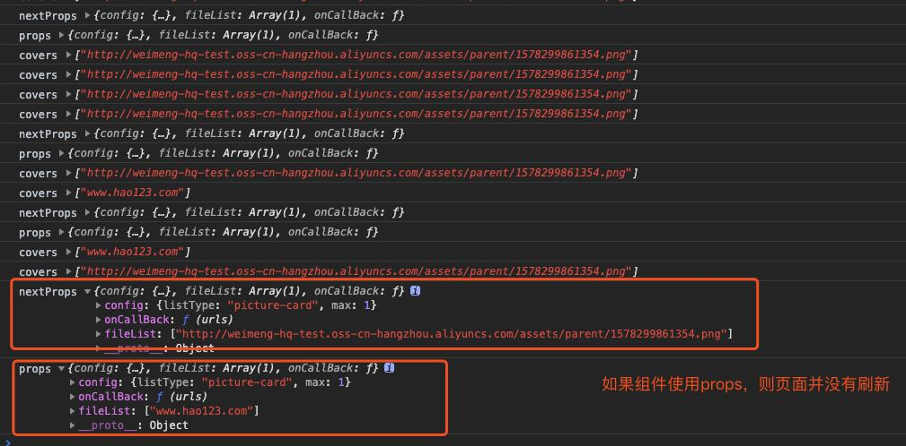

# 11.react



[生命周期](https://www.jianshu.com/p/b331d0e4b398#21-componentwillreceiveprops-nextprops)
```
  componentWillReceiveProps (nextProps) {
    console.log("nextProps", nextProps)
    console.log("props", this.props)
    this.setState({
      fileList: genFileList(nextProps.fileList),
    });
  }
// 这种操作会引发的问题，重复打开，关闭弹框，model中的upload会更新，但是upload上传又没法更新了
```

解决： 不使用生命周期，完全采用赋值
```
  state = {
    fileList: genFileList(this.props.fileList),
  };

```