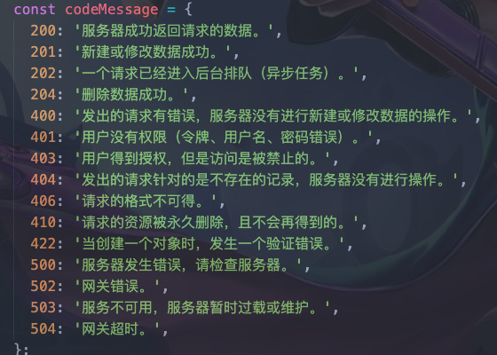

# 3.3 umi-request

# umi-request

```
在Antd-pro里面，使用的是umi-request,为了实现动态刷新token,我使用了拦截器。

拦截器更新token有两种：

方法一：在请求发起前拦截每个请求，判断token的有效时间是否已经过期，若已过期，则将请求挂起，先刷新token后再继续请求。

优点： 在请求前拦截，能节省请求，省流量。
缺点： 需要后端额外提供一个token过期时间的字段 refreshTime ；使用了本地时间判断，若本地时间被篡改，特别是本地时间比服务器时间慢时，拦截会失败。

方法二：拦截返回后的数据。先发起请求，接口返回过期后，先刷新token，再进行一次重试。

优点：不需额外的token过期字段，不需判断时间。
缺点： 会消耗多一次请求，耗流量。

综上考虑，方法一和二优缺点是互补的，方法一有校验失败的风险（本地时间被篡改时，当然一般没有用户闲的蛋疼去改本地时间的啦），方法二更简单粗暴，等知道服务器已经过期了再重试一次，只是会耗多一个请求。

我看有的博主用了方法二，我个人更喜欢方法一，（原因就是有的请求要求并发，for循环，一次出去10个请求，所以嘛。。。）

下面是实现过程

```





```js
/**
 * request 网络请求工具
 * 更详细的 api 文档: https://github.com/umijs/umi-request
 */
import { extend } from 'umi-request';
import { notification } from 'antd';
import { routerRedux } from 'dva/router';
import { getUserToken, saveUserToken, clearAuthority } from './authority';
import jwt_decode from 'jwt-decode'
const codeMessage = {
  200: '服务器成功返回请求的数据。',
  201: '新建或修改数据成功。',
  202: '一个请求已经进入后台排队（异步任务）。',
  204: '删除数据成功。',
  400: '发出的请求有错误，服务器没有进行新建或修改数据的操作。',
  401: '用户没有权限（令牌、用户名、密码错误）。',
  403: '用户得到授权，但是访问是被禁止的。',
  404: '发出的请求针对的是不存在的记录，服务器没有进行操作。',
  406: '请求的格式不可得。',
  410: '请求的资源被永久删除，且不会再得到的。',
  422: '当创建一个对象时，发生一个验证错误。',
  500: '服务器发生错误，请检查服务器。',
  502: '网关错误。',
  503: '服务不可用，服务器暂时过载或维护。',
  504: '网关超时。',
};
/**
 * 异常处理程序
 */

const errorHandler = error => {
  const { response } = error;

  if (response && response.status) {
    const errorText = codeMessage[response.status] || response.statusText;
    const { status, url } = response;
    notification.error({
      message: `请求错误 ${status}: ${url}`,
      description: errorText,
    });
  } else if (!response) {
    notification.error({
      description: '您的网络发生异常，无法连接服务器',
      message: '网络异常',
    });
  }

  return response;
};
/**
 * 配置request请求时的默认参数
 */

const request = extend({
  errorHandler,
  // 默认错误处理
  credentials: 'include', // 默认请求是否带上cookie
});

let _cacheRequest = [];
let guoqi = true; // 过期标记
let ispending = false; // 请求中标记
request.interceptors.request.use(async (url, options) => {

    const token = getUserToken();
    if( token ){
        //如果有token 就走token逻辑
        const headers = {
            Authorization: `Bearer ${token}`,
        };
        //如果是刷新token接口，就直接过，不要拦截它！！！
        if( url === '/weiqinketop/api/account/login/getnewtoken'){
            return ({
                url: url,
                options: { ...options, headers: headers },
            });
        }
        let decodeToken = jwt_decode(token);
        const { iat, exp, refreshTime } = decodeToken;
        const maxTime = exp*1000+refreshTime;
        const nowTime = new Date().getTime();
        console.log( parseInt((maxTime - nowTime)/1000) +'秒后重新登录')
        if( nowTime >= maxTime){
            //token过期，而且延期token也过去了，那么，清空你的数据，直接返回登录，不允许操作了
            console.log('超时了')
            clearAuthority()
            location.href = '/user/login'
            return;
        }
        console.log( parseInt((exp*1000 - nowTime)/1000) + '秒后第一个过期' )
        if( nowTime >= exp*1000 ){
            //只是过期了，那就去拿新的token
            if( ispending ){
                //如果正在发送中，此请求就等一会吧，生成一个Promise 等新token返回的时候，我再resolve
            }else{
                //如果没发送，立刻改为发送状态
                ispending = true;
                //如果过期了还没请求新token,那就请求新token 记得带上旧token
                request('/weiqinketop/api/account/login/getnewtoken',{
                    method: 'POST',
                    data:{}    
                }).then((res)=>{
                    if( res.status === 200 ){
                        ispending = false;
                        let token = res.token;
                        saveUserToken( token )
                        _cacheRequest.map(cb => cb())
                    }
                })

            }
            return new Promise((resolve, reject) => {
                _cacheRequest.push(() => {
                    resolve()
                })
            });
        }
        return ({
            url: url,
            options: { ...options, headers: headers },
        });
    }
    return ({
        url: url,
        options: options,
    });
})
//第二个拦截器，为什么会存在第二个拦截器呢？就是因为第一个拦截器有可能返回Promise,那么Promise由第二个拦截器处理吧。之前因为这个问题跟umi提了issues。原来是我没搞明白。。。
request.interceptors.request.use(async (url, options) => {
    const token = getUserToken();
    if( token ){
        //如果有token 就走token逻辑
        const headers = {
            Authorization: `Bearer ${token}`,
        };
        return ({
            url: url,
            options: { ...options, headers: headers },
        });
    }
    return ({
        url: url,
        options: options,
    });


})
export default request;

```
说下中途遇到的问题吧，原本只有第一个拦截器，返回Promise，总是会造成请求二次重发，我后来请教官方，得知 resolve( request( url, options) ) 导致的重发请求，现在已经进行了修复，可以正常使用了，后台使用的node.js KOA，下面贴下代码吧

```js
/**** Token功能类 ****/
const jwt = require('jsonwebtoken');
/**** secret编码 ****/
const secret = '002c6';
/*****
 * 过期时间延长24小时
 */
// const refreshTime = 86400000;
/*****
 * 过期时间延长10s
 */
const refreshTime = 10000;

class Token{
     constructor() {
        this.jwt = jwt;
        this.secret = secret;
    }
    /*******生成的格式就是{alg: "HS256",typ: "JWT"}.{name: "你的名字字段",refreshTime: 10000,iat: 1573704935,exp: 1573704947.[signature] */
    createToken( payload , dateStr ){
        payload.refreshTime = refreshTime;
        return this.jwt.sign(payload, this.secret, { expiresIn: dateStr });
    }
}

// module.exports = {
//   proToken : new Token()
// }

exports.proToken = new Token()


```


# 项目中使用封装

```ts
// 端口越界错误提示信息
export function serverUrlErrorTip(port: string) {
  if (!['3000', '3001', '3002', '3003', '3004'].includes(port)) {
    notification.error({
      message: '此提示仅开发环境显示',
      description: '端口有误: 查看README.md 开发调试',
    });
  }
}

// 返回服务器类型
export function getServerType() {
  // 生产环境
  let serverType = `/wm3pb`;
  // 开发环境
  if (process.env.NODE_ENV === 'development') {
    const { port } = window.location;
    // 本地环境、开发开发、测试环境
    serverUrlErrorTip(port);
    serverType = `${PKG_JSON.serverType[port]}`;
  }
  return serverType;
}

// 返回服务器下载地址
export function getServerPath() {
  // 生产环境
  let serverPath = `${window.origin}/wm3pb`;
  // 开发环境
  if (process.env.NODE_ENV === 'development') {
    serverPath = `${window.origin}${getServerType()}`;
  }
  return serverPath;
}

```


```ts

/**
 * @Author hailong.chen
 * @Date 2019-07-08 13:53:45
 * @Description:
 */
import { extend } from 'umi-request';
import { notification } from 'antd';
import { getServerType, goSSOLogin } from '@/utils/utils';
// import { cacheCurrentWarehouse } from './cache';

interface ResponseError<D = any> extends Error {
  name: string;
  data: D;
  response: Response;
}

const codeMessage = {
  200: '服务器成功返回请求的数据。',
  201: '新建或修改数据成功。',
  202: '一个请求已经进入后台排队（异步任务）。',
  204: '删除数据成功。',
  400: '发出的请求有错误，服务器没有进行新建或修改数据的操作。',
  401: '用户没有权限（令牌、用户名、密码错误）。',
  403: '用户得到授权，但是访问是被禁止的。',
  404: '发出的请求针对的是不存在的记录，服务器没有进行操作。',
  406: '请求的格式不可得。',
  410: '请求的资源被永久删除，且不会再得到的。',
  422: '当创建一个对象时，发生一个验证错误。',
  500: '服务器发生错误，请检查服务器。',
  502: '网关错误。',
  503: '服务不可用，服务器暂时过载或维护。',
  504: '网关超时。',
};

/**
 * 异常处理程序
 */
const errorHandler = (error: ResponseError) => {
  const { response = {} as Response } = error;
  const errorText = codeMessage[response.status] || response.statusText;
  const { status } = response;

  notification.error({
    // message: `请求错误 ${status}: ${url}`,
    message: `请求错误 ${status}`,
    description: errorText,
  });
  return response;
};

const request = extend({
  errorHandler, // 默认错误处理
  credentials: 'include', // 默认请求是否带上cookie
});

// request.interceptors.request.use((url, options) => {
//   const sendOptions = {
//     ...options,
//   };
//   if (options && options.method && options.method.toLocaleLowerCase() === 'post') {
//     // @ts-ignore 上传不做处理
//     if (!options.isUpload) {
//       sendOptions.data = options.params;
//       delete sendOptions.params;
//     }
//   }
//   return (
//     {
//       url: `${getServerType()}/v1${url}`,
//       options: { ...sendOptions, interceptors: true },
//     }
//   );
// });
request.interceptors.request.use((url, options) => {
  // const warehouseId = cacheCurrentWarehouse.get().id;
  const sendOptions = {
    ...options,
    headers: {
      // warehouseId,
    },
  };

  if (
    options &&
    options.method &&
    options.method.toLocaleLowerCase() === 'post'
  ) {
    // @ts-ignore 上传不做处理
    if (!options.isUpload) {
      sendOptions.data = options.params;
      delete sendOptions.params;
    }
  }
  return {
    url: url.includes('sso')
      ? `${getServerType().replace('/wm3pb', '')}${url}`
      : `${getServerType()}${url}`,
    options: { ...sendOptions, interceptors: true },
  };
});

// @ts-ignore
request.interceptors.response.use(async response => {
  try {
    const data = (await response.clone().json()) || {};
    if (data && data.returnCode === 'X0110009') {
      goSSOLogin();
      return;
    }
    if (data && data.returnCode !== '000000' && data.returnMessage) {
      notification.error({
        message: data.returnMessage,
      });
    }
  } catch (error) {
    console.log('catch error:', error);
  }
  return response;
});

export default request;


```