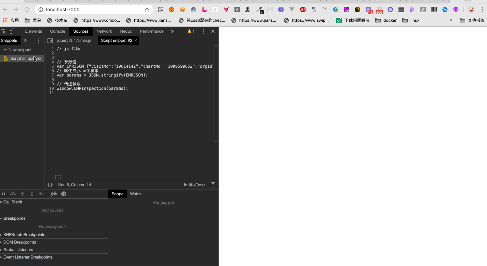

<!--
 * @version: v0.0.1
 * @Author: hailong.chen
 * @Date: 2020-01-10 10:32:16
 * @LastEditors  : hailong.chen
 * @LastEditTime : 2020-01-10 10:41:46
 * @Descripttion: 
 -->
# 10.4 chrome

[chrome执行额外的js脚本](https://www.cnblogs.com/WangHaiMing/p/9553678.html)


```js
// js 代码

console.log("js 代码");

// 参数值
var EMRJSON={"visitNo":"10614142","chartNo":"1000599852","orgId":"1001","ptName":"王莲珍","medRecordID":null,"admitTime":"2019-05-25 08:09:28","dischargeTime":"2019-05-31 14:03:50","rollback":0,"recordTypeName":"病案首页","subRecordType":null,"subRecordTypeName":null,"recordCls":{"recordType":3,"recordTypeName":"病案首页"},"basicInfo":{"id":27,"inTimes":1,"ptName":"王莲珍","sex":"女","birthdate":"1942-11-19 00:00:00","age":"76岁","idNumber":"330125194211191327","ocupation":"职业","marriage":"3","nation":"汉族","nationality":"中国","infantFlag":"false","babyBirthWeight":null,"babyInWeight":null,"birthAddr":"浙江省杭州市余杭区","nativeAddr":"浙江省杭州市","hukouAddr":"","hukouDetailAddr":"余杭区星桥汤家社区锦秀公寓","hukouPostcode":"311100","currentAddr":"浙江省杭州市余杭区","currentDetailAddr":"余杭区星桥汤家社区锦秀公寓","currentContact":"13868057078","currentPostcode":"311100","companyAddr":"无","companyContact":"无","companyPostcode":"无","contactName":"郭万元","contactNumber":"","contactRelation":"","contactAddr":"余杭区星桥汤家社区锦秀公寓","chartNo":"1000599852","visitNo":"10614142","birthCity":"浙江省杭州市余杭区"},"admitInfo":{"id":24,"paymentWay":"2","inWay":"1","admitTime":"2019-04-26 16:20:38","inDeptName":"心血管内科住院19","inDeptId":"10504","ward":"十九病区","inBed":"1931","physicianGroupId":null,"deptLeaderID":"0256","deptLeaderName":"於华敏","zrPhysicianID":"0256","zrPhysicianName":"於华敏","zzPhysicianID":"0279","zzPhysicianName":"叶利","zyPhysicianID":"0875","zyPhysicianName":"屠思佳","nurseID":"7304","nurseName":"沈小芳","recordQuality":"甲","qcDoctor":"0256","qcNurse":"0657","qcDate":"2019-06-04 00:00:00","extHurtReason":null,"bloodType":6,"chartNo":"1000599852","allergyHistory":null,"transferRecord":null,"rhbloodType":null},"dischargeInfo":{"id":24,"dischargeTime":"2019-05-31 14:03:50","outDeptId":"10504","outDeptName":"心血管内科住院19","outBed":"1923","inDay":6,"leaveWay":1,"receptionHospital":null,"inAgain":1,"inAgainReason":null,"beforeInComaTime":"","afterInComaTime":"","healSituation":2,"rescueNo":0,"successRescueNo":0,"autopsyNote":null,"singleDiseaseMage":"否","cliPathMage":"否","mzORcy":"符合","ryORcy":"符合","sqORsh":"未做","lcORbl":"未做","fsORbl":"未做","chartNo":"1000599852"},"diagInfo":[{"id":60,"diagType":2,"diagLeft":null,"diagRight":null,"diagName":"陈旧性肺结核 右肺毁损","diagTurnTo":2,"diagSituation":1,"chartNo":"1000599852"},{"id":63,"diagType":2,"diagLeft":null,"diagRight":null,"diagName":"高血压病","diagTurnTo":2,"diagSituation":1,"chartNo":"1000599852"},{"id":66,"diagType":3,"diagLeft":null,"diagRight":null,"diagName":"扩张型心肌病","diagTurnTo":null,"diagSituation":null,"chartNo":"1000599852"},{"id":69,"diagType":1,"diagLeft":null,"diagRight":null,"diagName":"扩张型心肌病","diagTurnTo":2,"diagSituation":1,"chartNo":"1000599852"},{"id":72,"diagType":2,"diagLeft":null,"diagRight":null,"diagName":"心功能Ⅳ级","diagTurnTo":2,"diagSituation":1,"chartNo":"1000599852"},{"id":75,"diagType":2,"diagLeft":null,"diagRight":null,"diagName":"多发腔隙性脑梗死","diagTurnTo":2,"diagSituation":1,"chartNo":"1000599852"},{"id":78,"diagType":2,"diagLeft":null,"diagRight":null,"diagName":"睡眠障碍","diagTurnTo":2,"diagSituation":1,"chartNo":"1000599852"}],"operationInfo":[],"recordType":3,"comeTime":"Thu Jan 01 1970 08:00:00 GMT+0800 (中国标准时间)","postTime":"Fri Jan 10 2020 09:13:22 GMT+0800 (中国标准时间)"};
// 转化成json字符串
var params = JSON.stringify(EMRJSON);

// 传递参数
window.EMRInspection(params);


```


