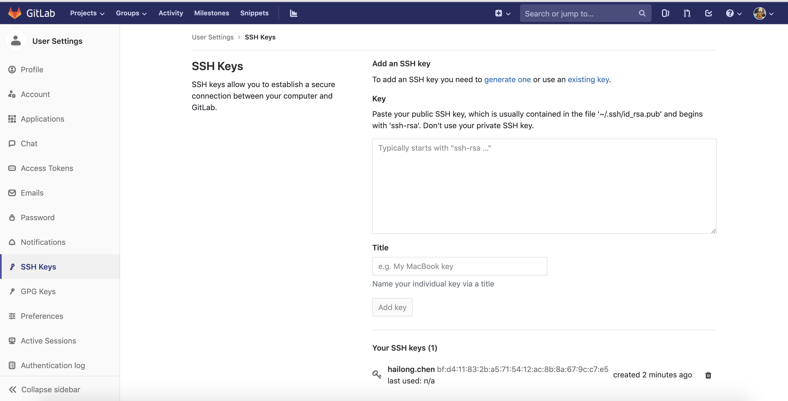
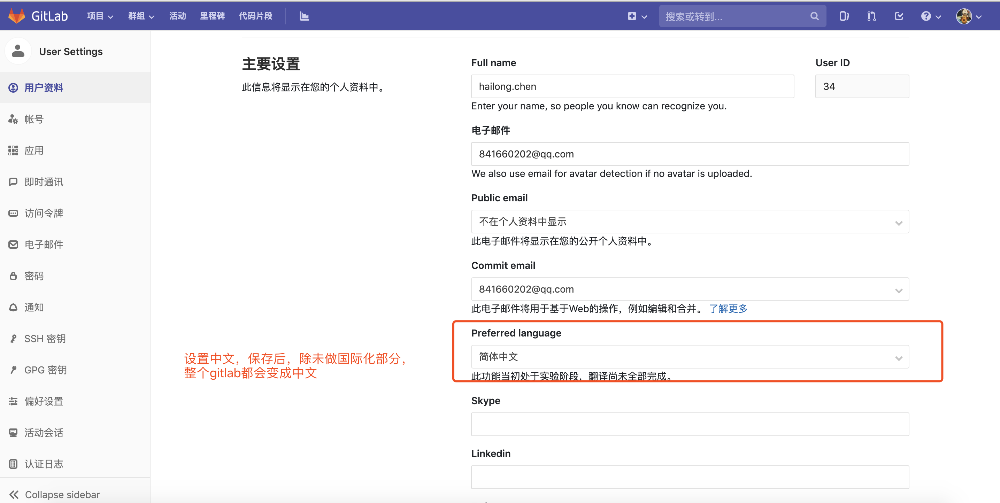
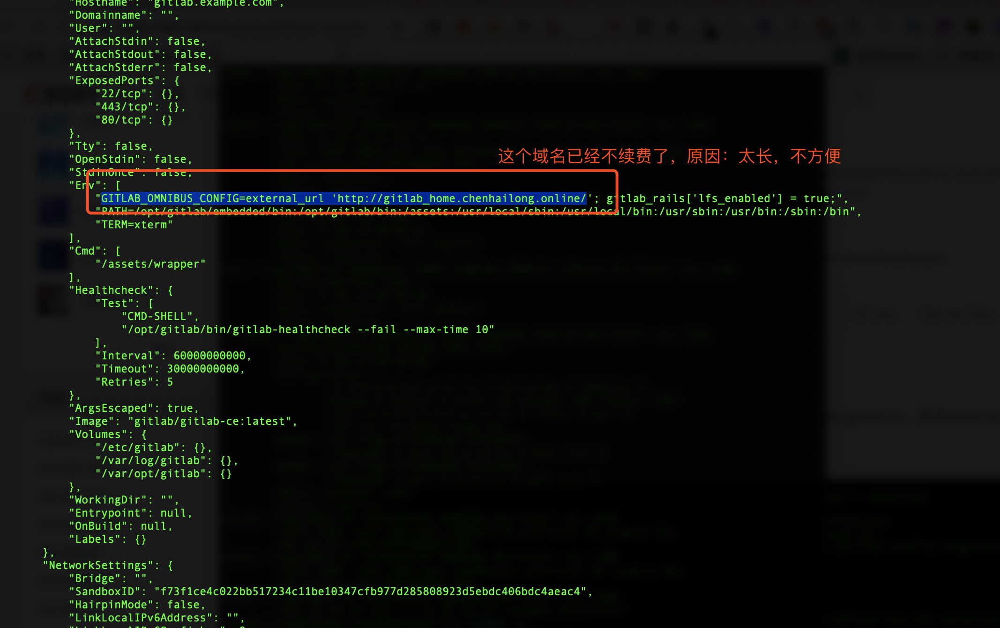
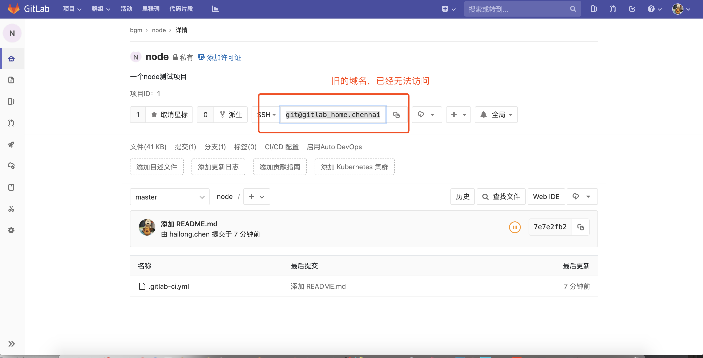
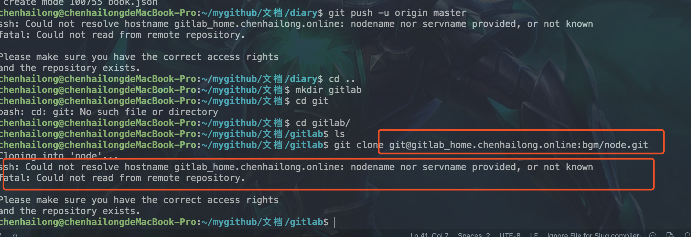
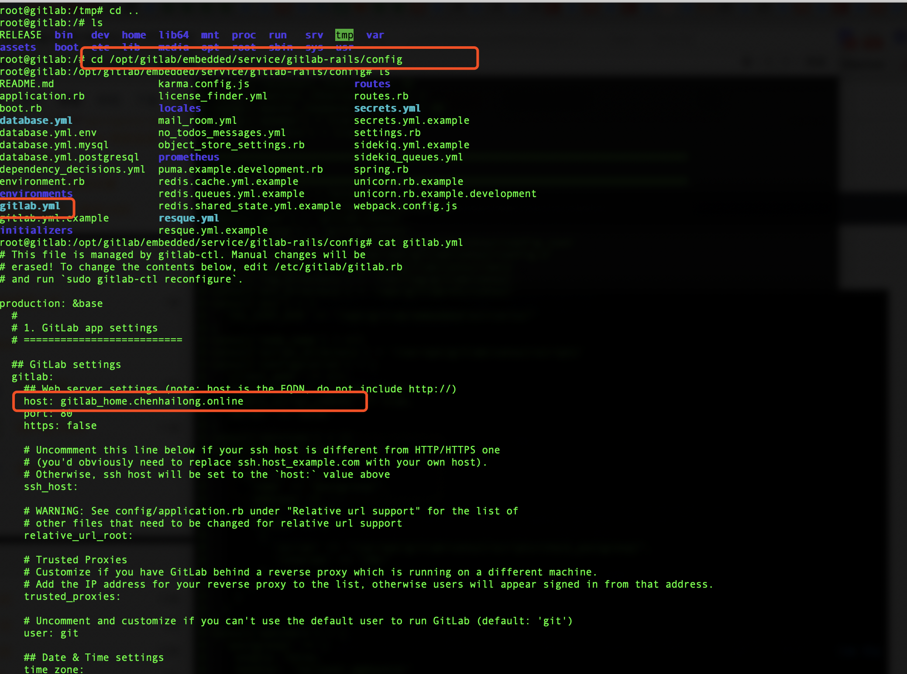
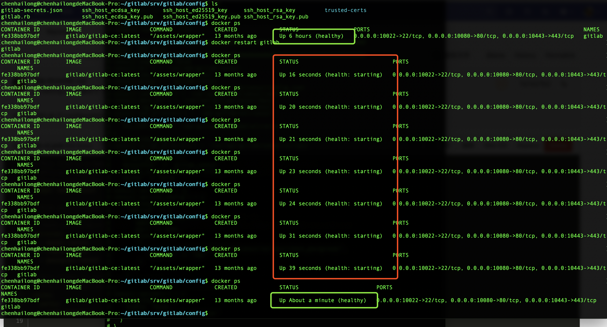
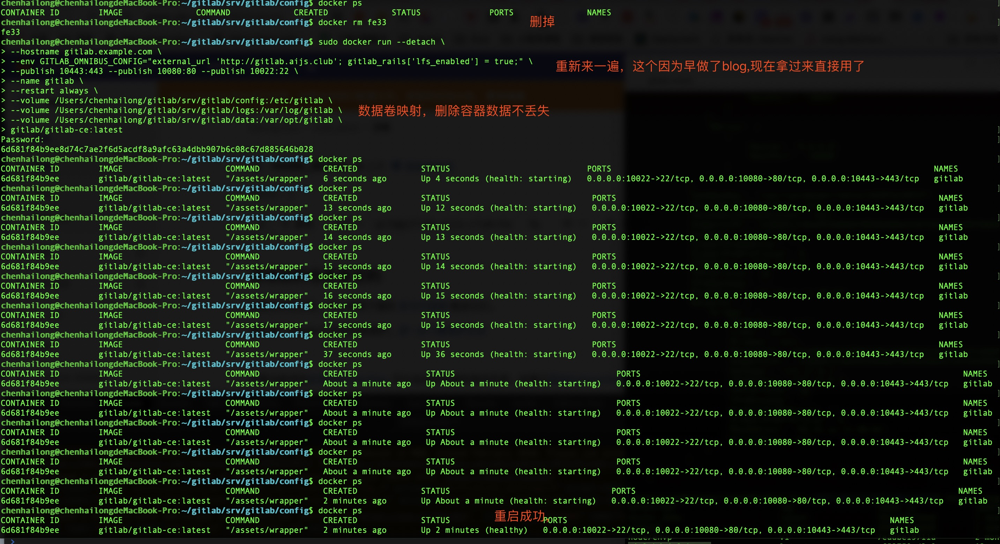
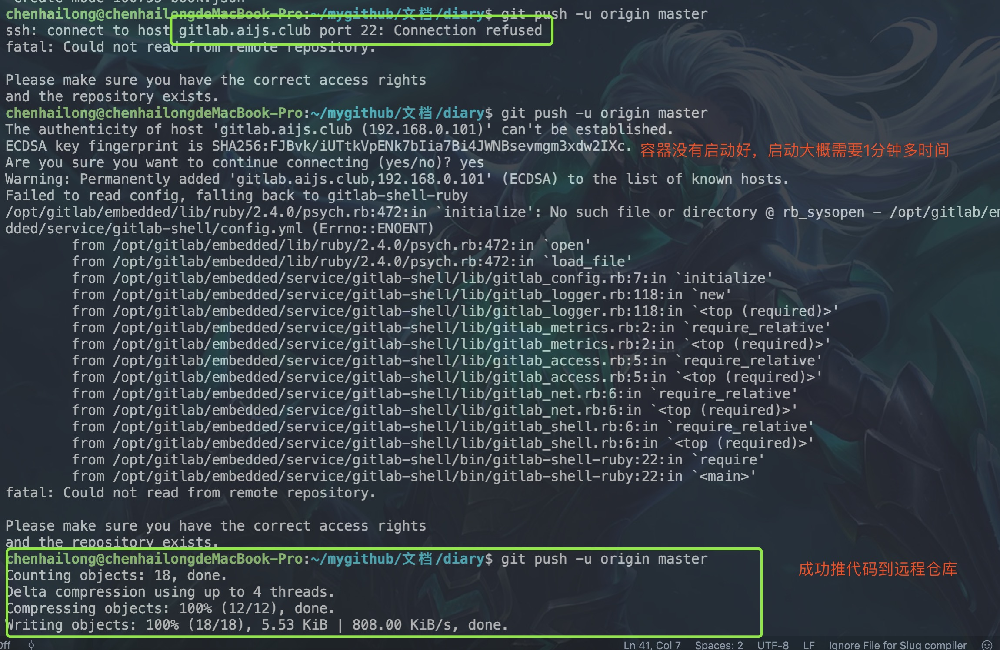
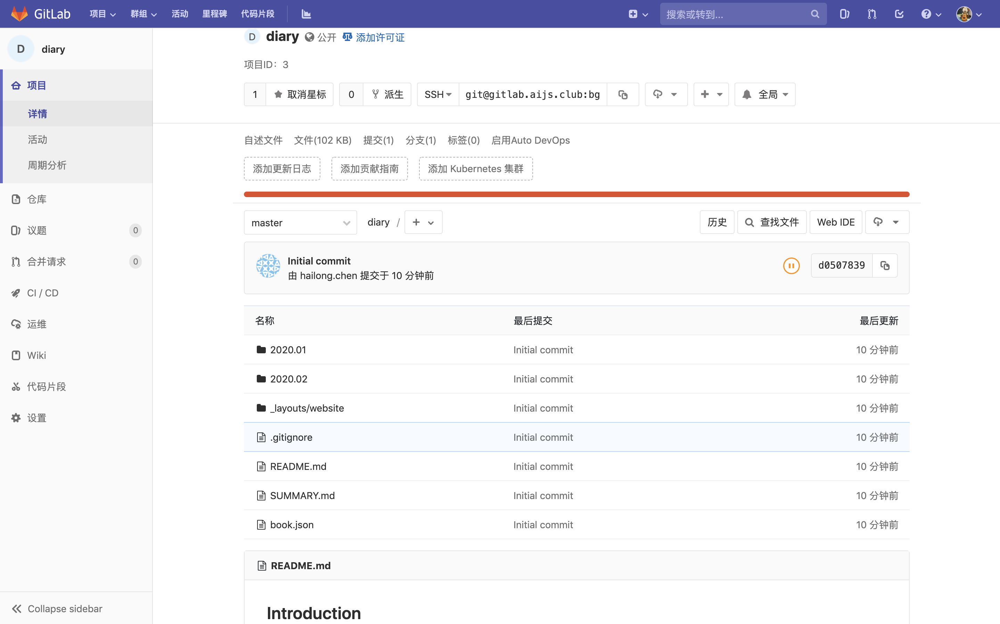

<!--
 * @version: v0.0.1
 * @Author: hailong.chen
 * @Date: 2020-01-05 09:49:09
 * @LastEditors  : hailong.chen
 * @LastEditTime : 2020-01-09 13:34:32
 * @Descripttion: 
 -->
# 10.2 gitlab


熟悉gitlab








我是在本机局域网搭建的gitlab, 切记服务器配置不能太低, gitlab比较耗资源, 这也是它功能强大的来源, 搭建环境:

系统: centOS7, 8G内存, i5处理器
ip: 10.12.2.22
预留端口: 8090

作者：Holeski
链接：https://www.jianshu.com/p/ce6d0bd7113a
来源：简书
著作权归作者所有。商业转载请联系作者获得授权，非商业转载请注明出处。


由于是docker镜像运行, 所以我们需要把gitlab的配置, 数据, 日志存到容器外面, 即将其挂载到宿主机。
先准备三个目录：
```
mkdir -p /home/software/gitlab/etc
mkdir -p /home/software/gitlab/logs
mkdir -p /home/software/gitlab/data
```


准备好这三个目录之后， 就可以开始运行 Docker 镜像了。完整的运行命令如下 ( 查看更多详细配置 )：
```


docker run \
--detach \
--publish 10443:443 \    # 映射https端口, 不过本文中没有用到
--publish 8090:80 \      # 映射宿主机8090端口到容器中80端口
--publish 8022:22 \      # 映射22端口, 可不配
--name gitlab \            
--restart always \
--hostname 10.12.2.22 \    # 局域网宿主机的ip, 如果是公网主机可以写域名
-v /home/software/gitlab/etc:/etc/gitlab \    # 挂载gitlab的配置文件
-v /home/software/gitlab/logs:/var/log/gitlab \    # 挂载gitlab的日志文件
-v /home/software/gitlab/data:/var/opt/gitlab \    # 挂载gitlab的数据
-v /etc/localtime:/etc/localtime:ro \    # 保持宿主机和容器时间同步
--privileged=true beginor/gitlab-ce    # 在容器中能以root身份执行操作
```


更换域名[Gitlab external_url 路径问题及解决方案](https://blog.csdn.net/qq_37143673/article/details/86624630)

```
vi /opt/gitlab/embedded/service/gitlab-rails/config/gitlab.yml
```
经测试无效

gitlab.yml开头有以下内容

```
# This file is managed by gitlab-ctl. Manual changes will be
# erased! To change the contents below, edit /etc/gitlab/gitlab.rb
# and run `sudo gitlab-ctl reconfigure`.


```

查看 gitlab.rb
root@gitlab:/etc/gitlab# cat gitlab.rb
## GitLab configuration settings
##! This file is generated during initial installation and **is not** modified
##! during upgrades.
##! Check out the latest version of this file to know about the different
##! settings that can be configured by this file, which may be found at:
##! https://gitlab.com/gitlab-org/omnibus-gitlab/raw/master/files/gitlab-config-template/gitlab.rb.template


## GitLab URL
##! URL on which GitLab will be reachable.
##! For more details on configuring external_url see:
##! https://docs.gitlab.com/omnibus/settings/configuration.html#configuring-the-external-url-for-gitlab
# external_url 'GENERATED_EXTERNAL_URL'


也没什么有用的


重新用docker运行gitlab







以上经测试无效

下面把容器删掉，重新运行一个容器




最终修改的命令如下：
```
sudo docker run --detach \
	--hostname gitlab.example.com \
	--env GITLAB_OMNIBUS_CONFIG="external_url 'http://gitlab.aijs.club/'; gitlab_rails['lfs_enabled'] = true;" \
	--publish 443:443 --publish 80:80 --publish 22:22 \
	--name gitlab \
	--restart always \
	--volume /Users/chenhailong/gitlab/srv/gitlab/config:/etc/gitlab \
	--volume /Users/chenhailong/gitlab/srv/gitlab/logs:/var/log/gitlab \
	--volume /Users/chenhailong/gitlab/srv/gitlab/data:/var/opt/gitlab \
	gitlab/gitlab-ce:latest


```


```
[root@iZbp1hun1qsl59e2nzqyvcZ ~]# docker exec -it gitlab-runner gitlab-ci-multi-runner register
Runtime platform                                    arch=amd64 os=linux pid=56 revision=ac8e767a version=12.6.0
Running in system-mode.                            
                                                   
Please enter the gitlab-ci coordinator URL (e.g. https://gitlab.com/):
https://code.choerodon.com.cn/
Please enter the gitlab-ci token for this runner:
thoSsSzeNp9gP82Kz1fv
Please enter the gitlab-ci description for this runner:
[1499396ed99d]: 猪齿鱼.node-demo
Please enter the gitlab-ci tags for this runner (comma separated):
atag,btag,ctag
Registering runner... succeeded                     runner=thoSsSze
Please enter the executor: parallels, shell, ssh, docker+machine, docker-ssh+machine, docker, docker-ssh, virtualbox, kubernetes, custom:
shell
Runner registered successfully. Feel free to start it, but if it's running already the config should be automatically reloaded! 
[root@iZbp1hun1qsl59e2nzqyvcZ ~]# 


```

