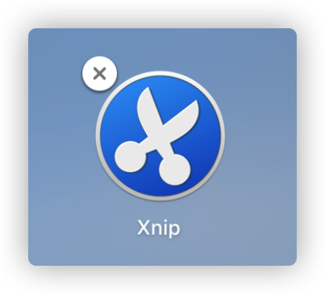
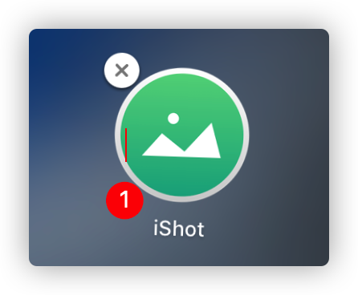
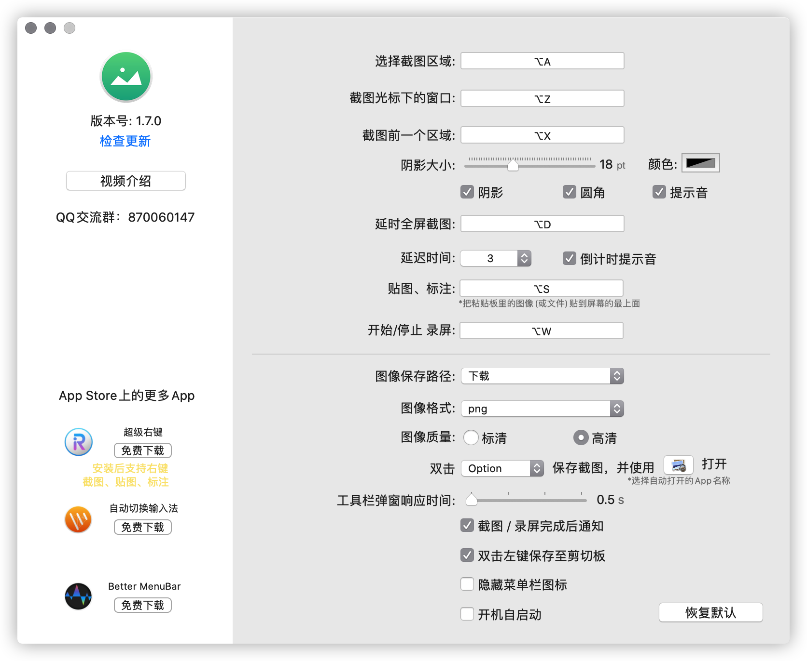
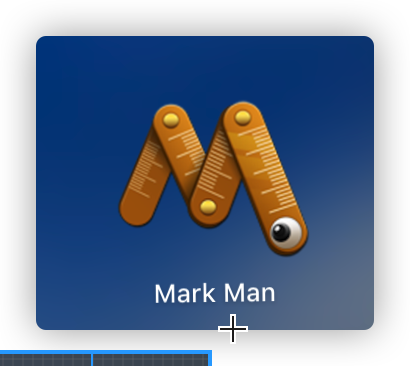
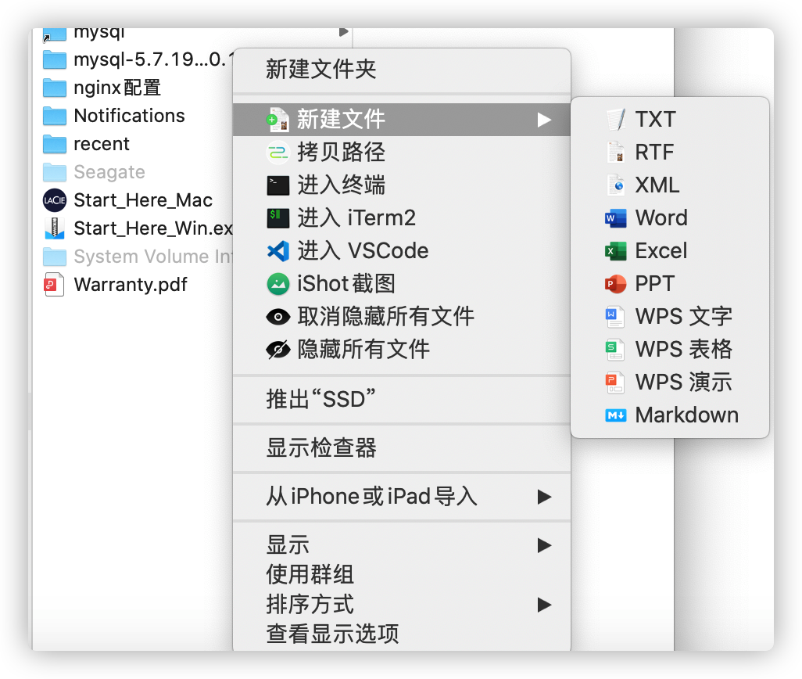
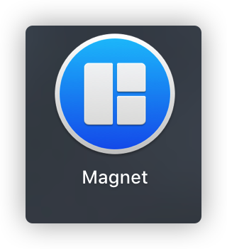
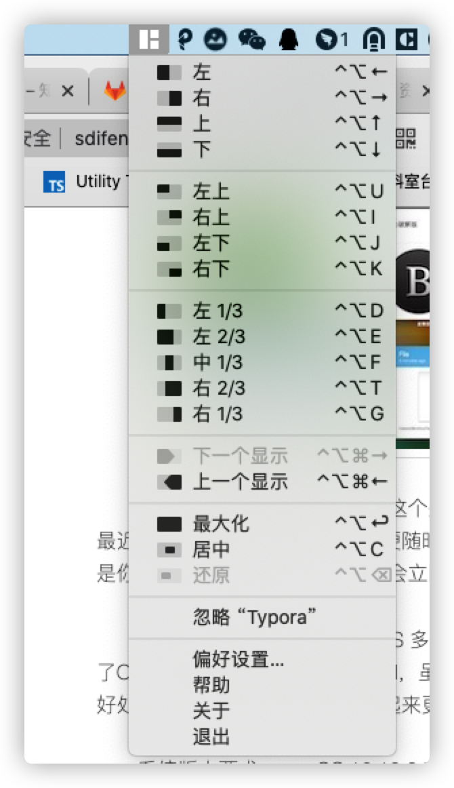

# 10.5 mac效率

### Typora.dmg（md）

- 可视化编辑**md**软件,可展示大纲

### Xnip(截图)

- 截图工具朋友全看到的图上会有Xnip logo,适用了还是可以的，比iShot略逊色

  

### iShot(截图)

- 截图软件，一般视频博主用的可截图缩放

### Mark Man（测量）

- 可以对图片进行测量的工具，在进行web开发时候会用到

### Paste(粘贴工具)

- 多次复制，多次粘贴

  

  

### IrightMouse(扩展右键)

### Magnet(分屏)

