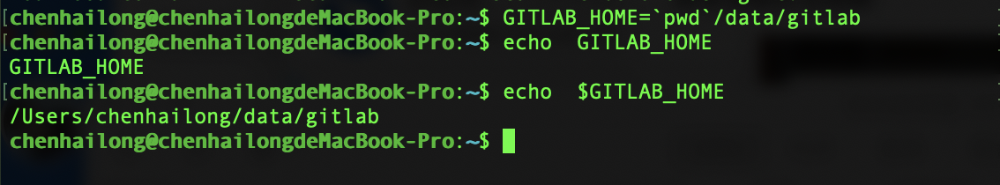
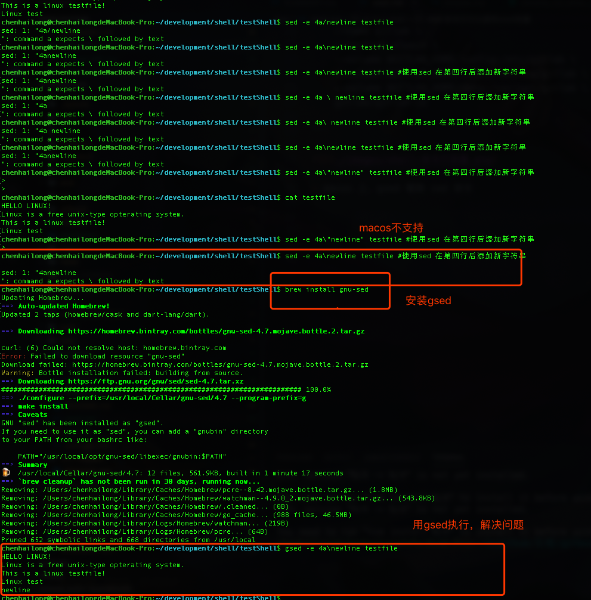
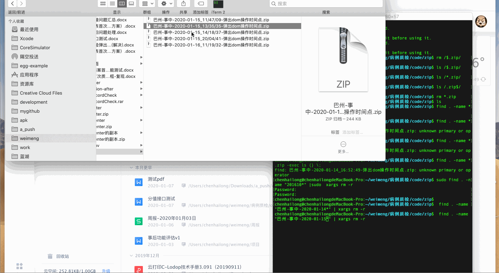

<!--
 * @version: v0.0.1
 * @Author: hailong.chen
 * @Date: 2020-01-06 10:41:10
 * @LastEditors  : hailong.chen
 * @LastEditTime : 2020-01-16 11:35:33
 * @Descripttion: 
 -->
# 10.3 shell

### 命令行可以使用shell变量

- 未来： 这个以后可以用到自动化部署中  

[参考](https://www.cnblogs.com/int32bit/p/5310382.html)

```
GITLAB_HOME=`pwd`/data/gitlab
docker run -d \
    --hostname gitlab \
    --publish 8443:443 --publish 80:80 --publish 2222:22 \
    --name gitlab \
    --restart always \
    --volume $GITLAB_HOME/config:/etc/gitlab \
    --volume $GITLAB_HOME/logs:/var/log/gitlab \
    --volume $GITLAB_HOME/data:/var/opt/gitlab \
    gitlab/gitlab-ce

```

   

- macos 上，gsed 替换 sed 命令

 

- macos 上，查找删除 find + rm
  
```
find . -name "巴州-事中-2020-01-*" | xargs rm -r

```

 
    
