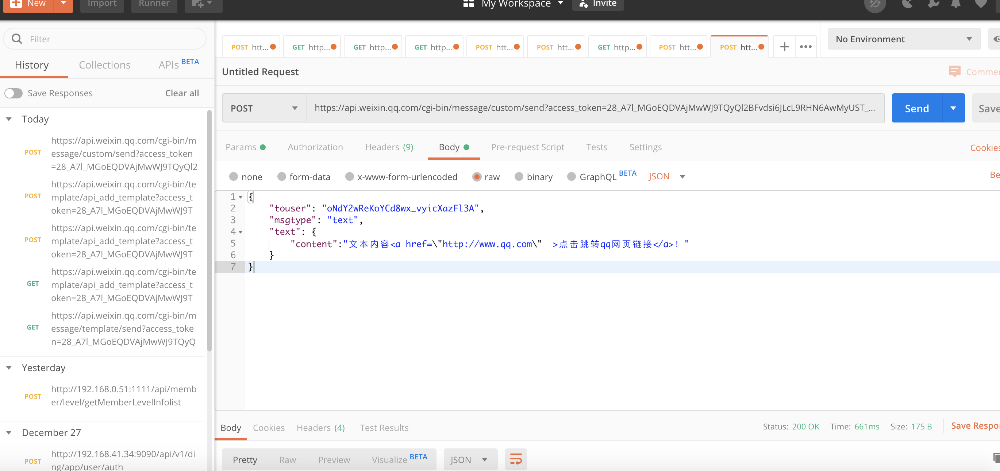
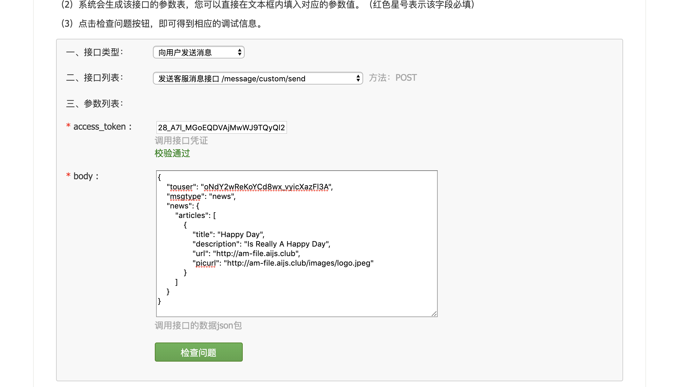

<!--
 * @version: v0.0.1
 * @Author: hailong.chen
 * @Date: 2019-12-29 13:40:30
 * @LastEditors  : hailong.chen
 * @LastEditTime : 2019-12-30 08:58:49
 * @Descripttion: 
 -->
# 1. 公众号开发

1. 分类
  - 个人公众号 (不能认证，部分接口权限)
  - 企业公众号 (能认证，全部接口权限)

2. 如何整一个企业公众号
   - 去某宝看了下，注册一个企业微信公众号；要花钱，对于自学来说“小贵”，毕竟现在还没有回报
   - 技术群请教
  
  
  

3. 接口测试账号申请
  
  [接口测试账号申请](https://developers.weixin.qq.com/doc/offiaccount/Basic_Information/Requesting_an_API_Test_Account.html)

4. 测试公众号

[](http://mp.weixin.qq.com/debug/cgi-bin/sandboxinfo?action=showinfo&t=sandbox/index)


5. 接口测试
  - [测试页面](https://mp.weixin.qq.com/debug/cgi-bin/apiinfo?t=index&type=%E5%9F%BA%E7%A1%80%E6%94%AF%E6%8C%81&form=%E8%8E%B7%E5%8F%96access_token%E6%8E%A5%E5%8F%A3%20/token)
   
  - [客服接口-发消息](https://developers.weixin.qq.com/doc/offiaccount/Message_Management/Service_Center_messages.html)

    接口调用请求说明

    http请求方式: POST

    https://api.weixin.qq.com/cgi-bin/message/custom/send?access_token=ACCESS_TOKEN

    各消息类型所需的JSON数据包如下：

    发送文本消息

  ```
  {
      "touser":"OPENID",
      "msgtype":"text",
      "text":
      {
          "content":"Hello World"
      }
  }
  ```

- 运行测试


- 测试结果


---

> [!TIP]
  说明： 记得刚接触小程序时候，有小程序推送的问题，现在可以解决了。（感悟做事：不是实现不了，而是实现方式不对）

---

> [!NOTE]
消息下发位置说明：对于已关注公众号的，消息将下发到公众号会话里；未关注公众号的，将下发到服务通知。


文本消息：

```
{
    "touser": "oNdY2wReKoYCd8wx_vyicXazFl3A", 
    "msgtype": "text", 
    "text": {
        "content":"Hello World"
    }
}

```


文本消息添加链接：

```
{
    "touser": "oNdY2wReKoYCd8wx_vyicXazFl3A", 
    "msgtype": "text", 
    "text": {
        "content":"文本内容<a href=\"http://www.qq.com\"  >点击跳转qq网页链接</a>！"
    }
}

```




图文消息：

> [!TIP]
> 发送图文消息（点击跳转到外链） 图文消息条数限制在1条以内，注意，如果图文数超过1，则将会返回错误码45008。  


```
{
    "touser": "oNdY2wReKoYCd8wx_vyicXazFl3A", 
    "msgtype": "news", 
    "news": {
        "articles": [
            {
                "title": "Happy Day", 
                "description": "Is Really A Happy Day", 
                "url": "http://am-file.aijs.club", 
                "picurl": "http://am-file.aijs.club/images/logo.jpeg"
            }
        ]
    }
}
```



